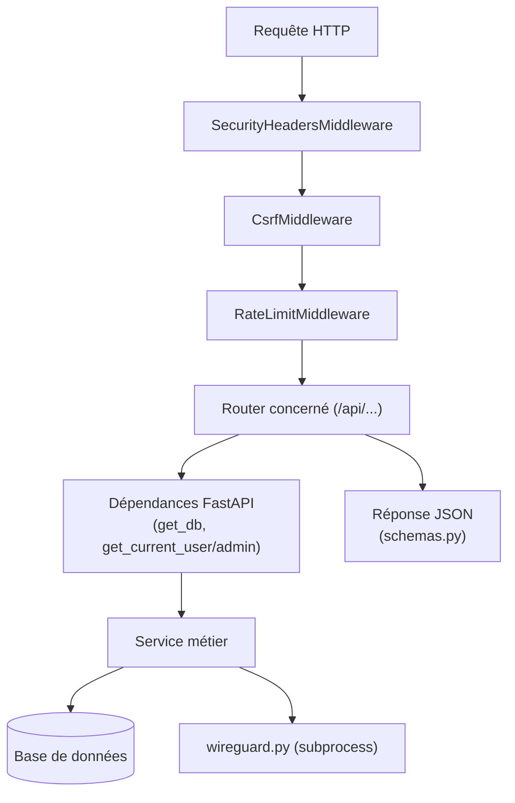

# Architecture backend (FastAPI)

```
backend/
├── pyproject.toml, uv.lock, alembic.ini
├── alembic/
│   ├── env.py
│   └── versions/           # migrations (0001 → 0004)
└── app/
    ├── main.py              # point d'entrée FastAPI
    ├── config.py             # AppSettings (pydantic-settings)
    ├── database.py           # moteur async + session
    ├── auth.py                # cookies JWT, dépendances get_current_user/admin
    ├── security.py            # middlewares (CSRF, rate-limit, en-têtes)
    ├── proxy.py                # résolution IP client derrière reverse-proxy
    ├── exceptions.py           # handlers d'erreurs normalisés
    ├── helpers.py               # utilitaires (ex. anti path-traversal)
    ├── models.py                 # entités SQLModel (tables)
    ├── schemas.py                 # schémas Pydantic (entrée/sortie API)
    ├── routers/                    # un fichier par domaine fonctionnel
    ├── services/                    # logique métier réutilisable
    ├── static/swagger/               # Swagger UI auto-hébergé
    └── templates/                     # emails HTML (en/fr/es)
```

## `main.py`

C'est le point d'entrée de l'application (`app.main:app`). Il assemble tout ce qui suit, dans cet ordre :

### 1. Création de l'app

```python
app = FastAPI(
    title="WireGuard UI",
    version=app_settings.app_version,
    lifespan=lifespan,
    docs_url=None,        # Swagger géré manuellement (auto-hébergé)
    redoc_url=None,
    openapi_url="/api/openapi.json" if app_settings.swagger_enabled else None,
)
```

### 2. Middlewares (dans l'ordre d'ajout)

| Middleware                  | Rôle                                                                                                                                                                                                                     |
| --------------------------- | ------------------------------------------------------------------------------------------------------------------------------------------------------------------------------------------------------------------------ |
| `SecurityHeadersMiddleware` | Ajoute les en-têtes de sécurité (CSP, HSTS, X-Frame-Options, etc.) à chaque réponse.                                                                                                                                     |
| `CsrfMiddleware`            | Protection CSRF _double-submit cookie_ : sur les méthodes non sûres (`POST`/`PUT`/`PATCH`/`DELETE`) d'une route `/api/*` authentifiée par cookie, exige que le header `X-CSRF-Token` corresponde au cookie `csrf_token`. |
| `RateLimitMiddleware`       | Limite le nombre de requêtes par IP (fenêtre glissante), avec un seuil plus strict pour `/api/auth/login` et `/api/auth/token`.                                                                                          |

Détails complets : [Authentification & sécurité](../fonctions/authentification.md).

### 3. Exception handlers

`RequestValidationError` et `StarletteHTTPException` sont interceptées et reformatées en JSON normalisé `{code, message, details}` (`exceptions.py`), pour que le frontend Angular ait un format d'erreur prévisible.

### 4. Cycle de vie (`lifespan`)

```python
@asynccontextmanager
async def lifespan(app: FastAPI):
    await seed_initial_data()
    if app_settings.wg_autostart:
        await auto_start_wireguard()
    yield
    await engine.dispose()
```

- **`seed_initial_data()`** ([services/seed.py](../fonctions/services.md#seedpy)) : crée les rôles, l'administrateur initial et les réglages par défaut s'ils n'existent pas déjà. Exécuté à **chaque** démarrage (idempotent).
- **`auto_start_wireguard()`** : si `WIREGUARD_AUTOSTART` est activé, écrit la configuration serveur (`write_server_config`) et démarre le service WireGuard (`start_service`). En cas d'échec, jusqu'à 3 tentatives espacées de 5 secondes, puis abandon avec un log d'erreur — **sans bloquer le démarrage de l'API**.
- À l'arrêt, `engine.dispose()` ferme proprement le pool de connexions à la base.

### 5. Routers

Chaque router est monté avec un préfixe `/api/<domaine>` (détail complet dans [Routers (endpoints)](../fonctions/routers.md)) :

```python
app.include_router(auth.router, prefix="/api/auth")
app.include_router(clients.router, prefix="/api/clients")
app.include_router(server.router, prefix="/api/server")
app.include_router(settings.router, prefix="/api/settings")
app.include_router(oidc.router, prefix="/api/oidc")
app.include_router(status.router, prefix="/api/status")
app.include_router(users.router, prefix="/api/users")
app.include_router(smtp.router, prefix="/api/smtp")
app.include_router(audit.router, prefix="/api/audit")
app.include_router(pat.router, prefix="/api/pat")
```

### 6. Endpoints hors routers

- `GET /api/health` — healthcheck simple, exclu du rate-limiting.
- `GET /api/docs` — Swagger UI auto-hébergé (aucune dépendance CDN), actif uniquement si `SWAGGER_ENABLED=true`.
- `GET /{full_path:path}` — **doit rester en dernier** : sert le build Angular (`frontend/dist/wireguard-ui/browser` copié en production dans `frontend/` relatif à `backend/app/`). Utilise `resolve_safe_path()` pour empêcher tout accès en dehors du dossier du SPA (path traversal), avec repli sur `index.html` pour laisser le routeur Angular gérer les routes côté client.

## `config.py`

Classe `AppSettings(BaseSettings)` chargée une fois via `get_settings()` (`@lru_cache`) et exposée comme singleton `app_settings`. Voir le détail complet des variables dans [Variables d'environnement](../demarrage/variables-environnement.md).

Point notable : `_resolve_secret_key()` génère et persiste une clé secrète aléatoire dans `DATA_DIR/secret_key` si `SECRET_KEY` n'est pas fourni explicitement, pour que les sessions restent valides entre redémarrages sans exposer une valeur par défaut connue.

## `database.py`

Moteur SQLAlchemy **asynchrone** (`create_async_engine`, driver `aiosqlite` ou `asyncpg`) et une factory de session (`AsyncSessionLocal`). La dépendance FastAPI `get_db()` fournit une session par requête, avec rollback automatique en cas d'exception.

## `proxy.py`

Résout l'adresse IP réelle du client (`client_ip(request)`), en tenant compte de `X-Forwarded-For` **uniquement** si la requête provient d'une IP listée dans `TRUSTED_PROXIES`. Utilisé par le rate-limiting et par la détection HTTPS (pour marquer le cookie de session `Secure`).

## Modèles et schémas

- **`models.py`** : entités SQLModel _table_ (persistées en base) — voir [Base de données & migrations](base-de-donnees.md).
- **`schemas.py`** : schémas Pydantic _non-table_ utilisés pour la validation des requêtes et le formatage des réponses API (ex. `ClientCreate`, `UserResponse`, `AuditLogPage`…), regroupés par domaine fonctionnel.

## Diagramme de la requête HTTP


