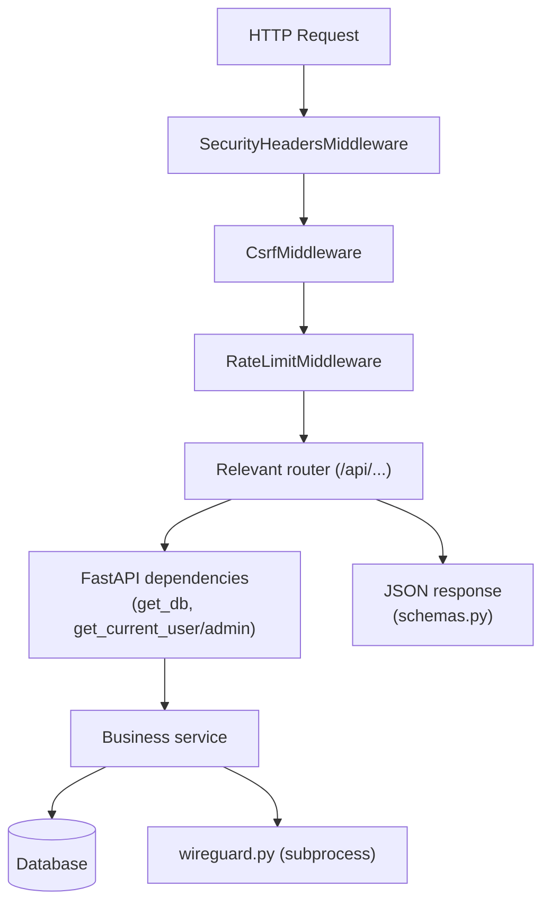

# Backend architecture (FastAPI)

```
backend/
├── pyproject.toml, uv.lock, alembic.ini
├── alembic/
│   ├── env.py
│   └── versions/           # migrations (0001 → 0004)
└── app/
    ├── main.py              # FastAPI entry point
    ├── config.py             # AppSettings (pydantic-settings)
    ├── database.py           # async engine + session
    ├── auth.py                # JWT cookies, get_current_user/admin dependencies
    ├── security.py            # middlewares (CSRF, rate-limit, headers)
    ├── proxy.py                # client IP resolution behind a reverse proxy
    ├── exceptions.py           # normalized error handlers
    ├── helpers.py               # utilities (e.g. anti path-traversal)
    ├── models.py                 # SQLModel entities (tables)
    ├── schemas.py                 # Pydantic schemas (API input/output)
    ├── routers/                    # one file per functional domain
    ├── services/                    # reusable business logic
    ├── static/swagger/               # self-hosted Swagger UI
    └── templates/                     # HTML emails (en/fr/es)
```

## `main.py`

This is the application's entry point (`app.main:app`). It assembles everything below, in this order:

### 1. App creation

```python
app = FastAPI(
    title="WireGuard UI",
    version=app_settings.app_version,
    lifespan=lifespan,
    docs_url=None,        # Swagger handled manually (self-hosted)
    redoc_url=None,
    openapi_url="/api/openapi.json" if app_settings.swagger_enabled else None,
)
```

### 2. Middlewares (in the order added)

| Middleware                  | Role                                                                                                                                                                                                      |
| --------------------------- | --------------------------------------------------------------------------------------------------------------------------------------------------------------------------------------------------------- |
| `SecurityHeadersMiddleware` | Adds security headers (CSP, HSTS, X-Frame-Options, etc.) to every response.                                                                                                                               |
| `CsrfMiddleware`            | _Double-submit cookie_ CSRF protection: for unsafe methods (`POST`/`PUT`/`PATCH`/`DELETE`) on a cookie-authenticated `/api/*` route, requires the `X-CSRF-Token` header to match the `csrf_token` cookie. |
| `RateLimitMiddleware`       | Limits the number of requests per IP (sliding window), with a stricter threshold for `/api/auth/login` and `/api/auth/token`.                                                                             |

Full details: [Authentication & security](../fonctions/authentification.md).

### 3. Exception handlers

`RequestValidationError` and `StarletteHTTPException` are intercepted and reformatted into a normalized JSON structure `{code, message, details}` (`exceptions.py`), so that the Angular frontend has a predictable error format.

### 4. Lifecycle (`lifespan`)

```python
@asynccontextmanager
async def lifespan(app: FastAPI):
    await seed_initial_data()
    if app_settings.wg_autostart:
        await auto_start_wireguard()
    yield
    await engine.dispose()
```

- **`seed_initial_data()`** ([services/seed.py](../fonctions/services.md#seedpy)): creates the roles, the initial administrator, and the default settings if they don't already exist. Run on **every** startup (idempotent).
- **`auto_start_wireguard()`**: if `WIREGUARD_AUTOSTART` is enabled, writes the server configuration (`write_server_config`) and starts the WireGuard service (`start_service`). On failure, up to 3 attempts spaced 5 seconds apart, then gives up with an error log — **without blocking API startup**.
- On shutdown, `engine.dispose()` cleanly closes the database connection pool.

### 5. Routers

Each router is mounted with an `/api/<domain>` prefix (full details in [Routers (endpoints)](../fonctions/routers.md)):

```python
app.include_router(auth.router, prefix="/api/auth")
app.include_router(clients.router, prefix="/api/clients")
app.include_router(server.router, prefix="/api/server")
app.include_router(settings.router, prefix="/api/settings")
app.include_router(oidc.router, prefix="/api/oidc")
app.include_router(status.router, prefix="/api/status")
app.include_router(users.router, prefix="/api/users")
app.include_router(smtp.router, prefix="/api/smtp")
app.include_router(audit.router, prefix="/api/audit")
app.include_router(pat.router, prefix="/api/pat")
```

### 6. Endpoints outside routers

- `GET /api/health` — simple healthcheck, excluded from rate limiting.
- `GET /api/docs` — self-hosted Swagger UI (no CDN dependency), active only if `SWAGGER_ENABLED=true`.
- `GET /{full_path:path}` — **must stay last**: serves the Angular build (`frontend/dist/wireguard-ui/browser`, copied in production to `frontend/` relative to `backend/app/`). Uses `resolve_safe_path()` to prevent any access outside the SPA folder (path traversal), falling back to `index.html` to let the Angular router handle client-side routes.

## `config.py`

`AppSettings(BaseSettings)` class loaded once via `get_settings()` (`@lru_cache`) and exposed as the `app_settings` singleton. See the full variable reference in [Environment variables](../demarrage/variables-environnement.md).

Notable point: `_resolve_secret_key()` generates and persists a random secret key in `DATA_DIR/secret_key` if `SECRET_KEY` is not explicitly provided, so sessions stay valid across restarts without exposing a known default value.

## `database.py`

**Asynchronous** SQLAlchemy engine (`create_async_engine`, `aiosqlite` or `asyncpg` driver) and a session factory (`AsyncSessionLocal`). The `get_db()` FastAPI dependency provides one session per request, with automatic rollback on exception.

## `proxy.py`

Resolves the real client IP address (`client_ip(request)`), taking `X-Forwarded-For` into account **only** if the request comes from an IP listed in `TRUSTED_PROXIES`. Used by rate limiting and HTTPS detection (to mark the session cookie `Secure`).

## Models and schemas

- **`models.py`**: SQLModel _table_ entities (persisted in the database) — see [Database & migrations](base-de-donnees.md).
- **`schemas.py`**: non-table Pydantic schemas used for request validation and API response formatting (e.g. `ClientCreate`, `UserResponse`, `AuditLogPage`…), grouped by functional domain.

## HTTP request diagram


