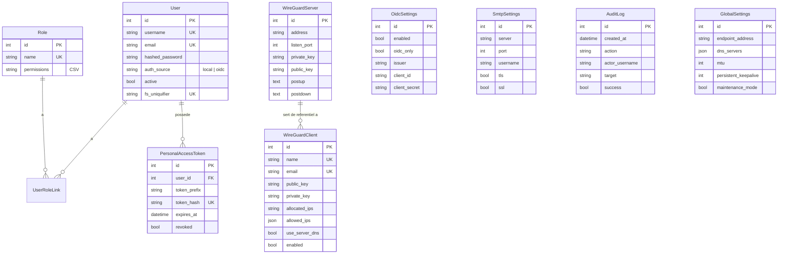

# Base de données & migrations

L'ORM utilisé est **SQLModel** (Pydantic v2 + SQLAlchemy), avec un accès **100% asynchrone** (`database.py`). Les migrations de schéma sont gérées par **Alembic**.

## Modèles (`backend/app/models.py`)



### Points notables

- **`User`** : `auth_source` distingue les comptes `local` (mot de passe géré par l'app) des comptes `oidc` (délégués à l'IdP — email/nom/mot de passe non modifiables depuis l'UI, voir [`users.py`](../fonctions/routers.md#userspy-apiusers-admin)). `fs_uniquifier` est un identifiant stable indépendant de l'`id`, utile pour invalider une session sans dépendre de la clé primaire.
- **`Role`** : les permissions sont stockées en **CSV** dans une colonne texte (`"admin-read,admin-write"`), lues via `Role.has_permission()`.
- **`WireGuardServer`** / **`WireGuardClient`** : une seule ligne serveur (référentiel de l'interface `wg0`), plusieurs lignes clients (un pair = une ligne). `allowed_ips` et `dns_servers` (sur `GlobalSettings`) sont stockés en JSON natif.
- **`OidcSettings`**, **`SmtpSettings`**, **`GlobalSettings`** : tables _singleton_ (une seule ligne), portant chacune un domaine de configuration distinct — historiquement fusionnées, elles ont été séparées par la migration `0002_split_settings_tables`.
- **`AuditLog`** : table **append-only** (jamais modifiée après insertion), avec purge automatique selon `AUDIT_MAX_EVENTS`/`AUDIT_RETENTION_DAYS` — voir [`services/audit.py`](../fonctions/services.md#auditpy).
- **`PersonalAccessToken`** : seul le **hash SHA-256** du token est stocké (`token_hash`), jamais le token en clair — celui-ci n'est renvoyé qu'une fois, à la création.

## Migrations Alembic (`backend/alembic/`)

| Révision                     | Contenu                                                                                          |
| ---------------------------- | ------------------------------------------------------------------------------------------------ |
| `0001_initial_schema`        | Schéma initial : `users`, `roles`, `user_roles`, `wg_server`, `wg_clients`, réglages initiaux.   |
| `0002_split_settings_tables` | Séparation des réglages en tables dédiées (`oidc_settings`, `smtp_settings`, `global_settings`). |
| `003_auth_source`            | Ajout de la colonne `auth_source` sur `users` (support OIDC).                                    |
| `0004_audit_and_pat`         | Ajout des tables `audit_log` et `personal_access_tokens`.                                        |

### `alembic/env.py`

Particularités de cette configuration :

- Ajoute `backend/` à `sys.path` pour que `from app.config import app_settings` fonctionne quel que soit le répertoire courant (le conteneur Docker lance `uvicorn` depuis `/app`, pas depuis `/app/backend`).
- Réutilise **la même URL de base de données que l'application** (`app_settings.db_path`), en la convertissant du driver asynchrone vers un driver synchrone (`sqlite+aiosqlite://` → `sqlite://`) car Alembic fonctionne en mode synchrone (`create_engine` + `NullPool`).
- `target_metadata = SQLModel.metadata` : Alembic peut donc générer des migrations automatiquement (`alembic revision --autogenerate`) à partir des modèles définis dans `models.py`.

### Appliquer les migrations

```bash
cd backend
uv run alembic upgrade head
```

- **En développement local**, cette commande doit être lancée manuellement avant le premier démarrage (voir [Installation locale](../demarrage/installation-locale.md)).
- **En production (image Docker)**, elle est exécutée automatiquement à chaque démarrage du conteneur par [`docker/entrypoint.sh`](../deploiement/docker.md#dockerentrypointsh), avant de lancer `uvicorn`.

### Créer une nouvelle migration

```bash
cd backend
uv run alembic revision --autogenerate -m "description du changement"
```

Un hook post-écriture (`alembic.ini`) exécute automatiquement `ruff check --fix` sur le fichier de migration généré.

## Base de données par défaut

Par défaut, l'application utilise **SQLite** (`DB_PATH=sqlite+aiosqlite:////var/lib/wireguard-ui/wireguard_ui.db`), suffisant pour un déploiement mono-instance. **PostgreSQL** est également supporté : il suffit de fournir une URL `postgres://` ou `postgresql://`, automatiquement convertie vers le driver asynchrone `asyncpg` par le validateur `normalize_db_path` de [`config.py`](backend.md#configpy).
