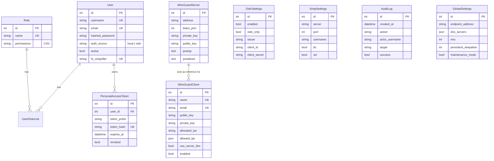

# Database & migrations

The ORM used is **SQLModel** (Pydantic v2 + SQLAlchemy), with **100% asynchronous** access (`database.py`). Schema migrations are handled by **Alembic**.

## Models (`backend/app/models.py`)



### Notable points

- **`User`**: `auth_source` distinguishes `local` accounts (password managed by the app) from `oidc` accounts (delegated to the IdP — email/name/password not editable from the UI, see [`users.py`](../fonctions/routers.md#userspy-apiusers-admin)). `fs_uniquifier` is a stable identifier independent of `id`, useful for invalidating a session without depending on the primary key.
- **`Role`**: permissions are stored as **CSV** in a text column (`"admin-read,admin-write"`), read via `Role.has_permission()`.
- **`WireGuardServer`** / **`WireGuardClient`**: a single server row (the `wg0` interface's reference data), multiple client rows (one peer = one row). `allowed_ips` and `dns_servers` (on `GlobalSettings`) are stored as native JSON.
- **`OidcSettings`**, **`SmtpSettings`**, **`GlobalSettings`**: _singleton_ tables (a single row each), each carrying a distinct configuration domain — historically merged, they were split apart by the `0002_split_settings_tables` migration.
- **`AuditLog`**: an **append-only** table (never modified after insertion), with automatic purging according to `AUDIT_MAX_EVENTS`/`AUDIT_RETENTION_DAYS` — see [`services/audit.py`](../fonctions/services.md#auditpy).
- **`PersonalAccessToken`**: only the **SHA-256 hash** of the token is stored (`token_hash`), never the token in clear text — it is returned only once, at creation.

## Alembic migrations (`backend/alembic/`)

| Revision                     | Content                                                                                        |
| ---------------------------- | ---------------------------------------------------------------------------------------------- |
| `0001_initial_schema`        | Initial schema: `users`, `roles`, `user_roles`, `wg_server`, `wg_clients`, initial settings.   |
| `0002_split_settings_tables` | Split of settings into dedicated tables (`oidc_settings`, `smtp_settings`, `global_settings`). |
| `003_auth_source`            | Added the `auth_source` column on `users` (OIDC support).                                      |
| `0004_audit_and_pat`         | Added the `audit_log` and `personal_access_tokens` tables.                                     |

### `alembic/env.py`

Notable aspects of this configuration:

- Adds `backend/` to `sys.path` so that `from app.config import app_settings` works regardless of the current directory (the Docker container launches `uvicorn` from `/app`, not from `/app/backend`).
- Reuses **the same database URL as the application** (`app_settings.db_path`), converting it from the async driver to a sync driver (`sqlite+aiosqlite://` → `sqlite://`) since Alembic runs in synchronous mode (`create_engine` + `NullPool`).
- `target_metadata = SQLModel.metadata`: Alembic can therefore generate migrations automatically (`alembic revision --autogenerate`) from the models defined in `models.py`.

### Applying migrations

```bash
cd backend
uv run alembic upgrade head
```

- **In local development**, this command must be run manually before the first startup (see [Local installation](../demarrage/installation-locale.md)).
- **In production (Docker image)**, it is run automatically on every container startup by [`docker/entrypoint.sh`](../deploiement/docker.md#dockerentrypointsh), before launching `uvicorn`.

### Creating a new migration

```bash
cd backend
uv run alembic revision --autogenerate -m "description of the change"
```

A post-write hook (`alembic.ini`) automatically runs `ruff check --fix` on the generated migration file.

## Default database

By default, the application uses **SQLite** (`DB_PATH=sqlite+aiosqlite:////var/lib/wireguard-ui/wireguard_ui.db`), sufficient for a single-instance deployment. **PostgreSQL** is also supported: simply provide a `postgres://` or `postgresql://` URL, automatically converted to the async `asyncpg` driver by the `normalize_db_path` validator in [`config.py`](backend.md#configpy).
