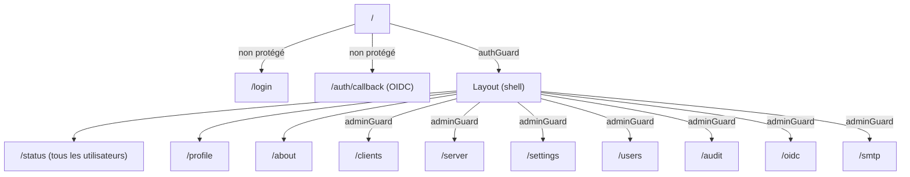

# Architecture frontend (Angular)

Application Angular moderne : **composants standalone**, **Signals**, **Signal Forms**, et **zoneless** (pas de `zone.js`).

```
frontend/src/app/
├── app.component.ts, app.config.ts, app.routes.ts
├── core/
│   ├── applets/          # champs de formulaire réutilisables
│   ├── guards/            # auth.guard.ts, admin.guard.ts
│   ├── interceptors/      # auth.interceptor.ts, error.interceptor.ts
│   ├── models/            # api.models.ts (miroir des schémas backend)
│   └── services/          # api.service.ts, auth.service.ts, theme.service.ts, ...
├── features/               # un dossier par écran/domaine fonctionnel
│   ├── about/, audit/, auth/login/, auth/oidc-callback/,
│   │   clients/, oidc/, profile/, server/, settings/,
│   │   smtp/, status/, users/
└── shared/components/
    ├── healthly/           # indicateur de santé backend
    ├── layout/              # shell applicatif (navigation, header)
    └── session-expired-modal/
```

## Configuration applicative — `app.config.ts`

```ts
export const appConfig: ApplicationConfig = {
  providers: [
    provideZonelessChangeDetection(),
    provideHttpClient(withFetch(), withInterceptors([authInterceptor, errorInterceptor])),
    provideRouter(routes),
    provideSignalFormsConfig({ ... }),
  ],
};
```

- **`provideZonelessChangeDetection()`** : la détection de changement ne repose pas sur `zone.js`, mais sur les Signals — meilleures performances, code plus explicite.
- **`withFetch()`** : `HttpClient` utilise l'API `fetch` native.
- **Intercepteurs** : `authInterceptor` (gestion des en-têtes CSRF/authentification) et `errorInterceptor` (normalisation des erreurs API, déclenchement de la modale de session expirée sur 401).
- **`provideSignalFormsConfig`** : configure les classes CSS (`is-invalid`/`is-valid`) appliquées automatiquement par les Signal Forms selon l'état de validation des champs.

## Routing — `app.routes.ts`



Toutes les pages sont chargées en **lazy-loading** (`loadComponent`). Les gardes `authGuard`/`adminGuard` reproduisent côté client les mêmes restrictions que le backend (`get_current_user`/`get_current_admin`) — mais l'autorité reste toujours le backend, qui revalide chaque requête API.

## Couche `core/`

### Services (`core/services/`)

| Fichier                      | Rôle                                                                                                                                                                                                                                                                                                |
| ---------------------------- | --------------------------------------------------------------------------------------------------------------------------------------------------------------------------------------------------------------------------------------------------------------------------------------------------- |
| `api.service.ts`             | `ApiService` central : une méthode par endpoint backend, puis des façades par domaine (`ClientsService`, `ServerService`, `SettingsService`, `SmtpService`, `UsersService`, `OidcService`, `AuditService`, `PatService`) qui encapsulent `ApiService` pour un usage sémantique dans les composants. |
| `auth.service.ts`            | État réactif (Signals) de l'utilisateur courant : `isAuthenticated`, `isAdmin`, `authSource`, `isOidc`. Le JWT lui-même reste dans un cookie `HttpOnly` (jamais accessible en JS) ; seul un résumé non sensible est mis en cache côté client. Expose `login()`/`logout()`.                          |
| `health.service.ts`          | Interroge `GET /api/health` pour piloter l'indicateur de santé (`shared/components/healthly`).                                                                                                                                                                                                      |
| `session-expired.service.ts` | Déclenche la modale de session expirée lorsqu'une réponse 401 est interceptée.                                                                                                                                                                                                                      |
| `theme.service.ts`           | Gestion du thème clair/sombre de l'interface.                                                                                                                                                                                                                                                       |

### Modèles (`core/models/api.models.ts`)

Interfaces TypeScript miroir des schémas Pydantic backend : `User`, `Role`, `WireGuardClient`/`ClientCreate`/`ClientUpdate`, `WireGuardServer`/`ServerCreate`, `GlobalSettings`/`SettingsUpdate`, `SmtpSettings`, `OidcAdminSettings`/`OidcPublicConfig`, `WireGuardStatus`/`PeerStatus`, `AuditLogEntry`/`AuditLogPage`, `Pat`/`PatCreate`/`PatCreateResponse`, `AppConfigResponse`.

### Intercepteurs (`core/interceptors/`)

- **`auth.interceptor.ts`** : ajoute le header CSRF (`X-CSRF-Token`) sur les requêtes non sûres, en s'appuyant sur le cookie `csrf_token` lisible en JS.
- **`error.interceptor.ts`** : normalise les erreurs HTTP renvoyées par le backend (format `{code, message, details}`) et déclenche la déconnexion/modale de session expirée sur une 401.

### Gardes (`core/guards/`)

- **`auth.guard.ts`** : bloque l'accès aux routes protégées si l'utilisateur n'est pas authentifié → redirection vers `/login`.
- **`admin.guard.ts`** : bloque l'accès aux pages d'administration si le rôle courant n'est pas `admin`.

## Features (`features/`)

Un dossier par écran, chacun avec son composant standalone, son template et ses styles. Correspondance directe avec les routers backend :

| Feature                              | Router backend correspondant         | Accès                           |
| ------------------------------------ | ------------------------------------ | ------------------------------- |
| `status/`                            | `status.py`                          | Tous les utilisateurs connectés |
| `clients/`                           | `clients.py`                         | Admin                           |
| `server/`                            | `server.py`                          | Admin                           |
| `settings/`                          | `settings.py`                        | Admin                           |
| `users/`                             | `users.py`                           | Admin                           |
| `audit/`                             | `audit.py`                           | Admin                           |
| `oidc/`                              | `oidc.py`                            | Admin (config) / public (login) |
| `smtp/`                              | `smtp.py`                            | Admin                           |
| `profile/`                           | `auth.py`, `pat.py`                  | Utilisateur connecté            |
| `auth/login/`, `auth/oidc-callback/` | `auth.py`, `oidc.py`                 | Public                          |
| `about/`                             | `status.py` (version/latest-release) | Utilisateur connecté            |

## Build et intégration avec le backend

```bash
npm run build   # ng build --configuration production
# → sortie dans frontend/dist/wireguard-ui/browser
```

En production, le `Dockerfile` copie ce dossier `browser` vers `/app/frontend`, et c'est FastAPI (route catch-all `serve_spa` dans `main.py`) qui le sert directement — un seul port (`8000`) suffit alors, backend et frontend étant servis par le même processus.

En développement, les deux applications tournent séparément : Angular sur `:4200` (avec `proxy.conf.json` qui relaie `/api/*` vers `:8000`), FastAPI sur `:8000`. Voir [Installation locale](../demarrage/installation-locale.md).
