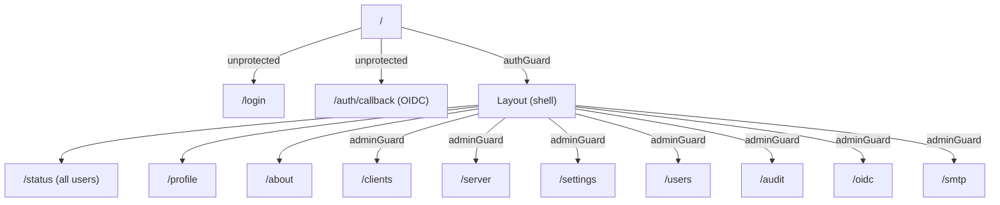

# Frontend architecture (Angular)

A modern Angular application: **standalone components**, **Signals**, **Signal Forms**, and **zoneless** (no `zone.js`).

```
frontend/src/app/
├── app.component.ts, app.config.ts, app.routes.ts
├── core/
│   ├── applets/          # reusable form fields
│   ├── guards/            # auth.guard.ts, admin.guard.ts
│   ├── interceptors/      # auth.interceptor.ts, error.interceptor.ts
│   ├── models/            # api.models.ts (mirrors backend schemas)
│   └── services/          # api.service.ts, auth.service.ts, theme.service.ts, ...
├── features/               # one folder per screen/functional domain
│   ├── about/, audit/, auth/login/, auth/oidc-callback/,
│   │   clients/, oidc/, profile/, server/, settings/,
│   │   smtp/, status/, users/
└── shared/components/
    ├── healthly/           # backend health indicator
    ├── layout/              # application shell (navigation, header)
    └── session-expired-modal/
```

## Application configuration — `app.config.ts`

```ts
export const appConfig: ApplicationConfig = {
  providers: [
    provideZonelessChangeDetection(),
    provideHttpClient(withFetch(), withInterceptors([authInterceptor, errorInterceptor])),
    provideRouter(routes),
    provideSignalFormsConfig({ ... }),
  ],
};
```

- **`provideZonelessChangeDetection()`**: change detection does not rely on `zone.js`, but on Signals — better performance, more explicit code.
- **`withFetch()`**: `HttpClient` uses the native `fetch` API.
- **Interceptors**: `authInterceptor` (CSRF/authentication header handling) and `errorInterceptor` (API error normalization, triggering the expired-session modal on 401).
- **`provideSignalFormsConfig`**: configures the CSS classes (`is-invalid`/`is-valid`) automatically applied by Signal Forms based on field validation state.

## Routing — `app.routes.ts`



All pages are **lazy-loaded** (`loadComponent`). The `authGuard`/`adminGuard` guards reproduce the same restrictions client-side as the backend (`get_current_user`/`get_current_admin`) — but the backend always remains the authority, revalidating every API request.

## `core/` layer

### Services (`core/services/`)

| File                         | Role                                                                                                                                                                                                                                                                          |
| ---------------------------- | ----------------------------------------------------------------------------------------------------------------------------------------------------------------------------------------------------------------------------------------------------------------------------- |
| `api.service.ts`             | Central `ApiService`: one method per backend endpoint, then domain-specific facades (`ClientsService`, `ServerService`, `SettingsService`, `SmtpService`, `UsersService`, `OidcService`, `AuditService`, `PatService`) that wrap `ApiService` for semantic use in components. |
| `auth.service.ts`            | Reactive (Signals) state of the current user: `isAuthenticated`, `isAdmin`, `authSource`, `isOidc`. The JWT itself stays in an `HttpOnly` cookie (never accessible from JS); only a non-sensitive summary is cached client-side. Exposes `login()`/`logout()`.                |
| `health.service.ts`          | Polls `GET /api/health` to drive the health indicator (`shared/components/healthly`).                                                                                                                                                                                         |
| `session-expired.service.ts` | Triggers the expired-session modal when a 401 response is intercepted.                                                                                                                                                                                                        |
| `theme.service.ts`           | Manages the light/dark theme of the interface.                                                                                                                                                                                                                                |

### Models (`core/models/api.models.ts`)

TypeScript interfaces mirroring the backend Pydantic schemas: `User`, `Role`, `WireGuardClient`/`ClientCreate`/`ClientUpdate`, `WireGuardServer`/`ServerCreate`, `GlobalSettings`/`SettingsUpdate`, `SmtpSettings`, `OidcAdminSettings`/`OidcPublicConfig`, `WireGuardStatus`/`PeerStatus`, `AuditLogEntry`/`AuditLogPage`, `Pat`/`PatCreate`/`PatCreateResponse`, `AppConfigResponse`.

### Interceptors (`core/interceptors/`)

- **`auth.interceptor.ts`**: adds the CSRF header (`X-CSRF-Token`) on unsafe requests, based on the JS-readable `csrf_token` cookie.
- **`error.interceptor.ts`**: normalizes HTTP errors returned by the backend (`{code, message, details}` format) and triggers logout/expired-session modal on a 401.

### Guards (`core/guards/`)

- **`auth.guard.ts`**: blocks access to protected routes if the user is not authenticated → redirects to `/login`.
- **`admin.guard.ts`**: blocks access to admin pages if the current role is not `admin`.

## Features (`features/`)

One folder per screen, each with its standalone component, template and styles. Direct correspondence with backend routers:

| Feature                              | Corresponding backend router         | Access                          |
| ------------------------------------ | ------------------------------------ | ------------------------------- |
| `status/`                            | `status.py`                          | All logged-in users             |
| `clients/`                           | `clients.py`                         | Admin                           |
| `server/`                            | `server.py`                          | Admin                           |
| `settings/`                          | `settings.py`                        | Admin                           |
| `users/`                             | `users.py`                           | Admin                           |
| `audit/`                             | `audit.py`                           | Admin                           |
| `oidc/`                              | `oidc.py`                            | Admin (config) / public (login) |
| `smtp/`                              | `smtp.py`                            | Admin                           |
| `profile/`                           | `auth.py`, `pat.py`                  | Logged-in user                  |
| `auth/login/`, `auth/oidc-callback/` | `auth.py`, `oidc.py`                 | Public                          |
| `about/`                             | `status.py` (version/latest-release) | Logged-in user                  |

## Build and integration with the backend

```bash
npm run build   # ng build --configuration production
# → output in frontend/dist/wireguard-ui/browser
```

In production, the `Dockerfile` copies this `browser` folder to `/app/frontend`, and FastAPI (the `serve_spa` catch-all route in `main.py`) serves it directly — a single port (`8000`) is then enough, with backend and frontend served by the same process.

In development, the two applications run separately: Angular on `:4200` (with `proxy.conf.json` relaying `/api/*` to `:8000`), FastAPI on `:8000`. See [Local installation](../demarrage/installation-locale.md).
