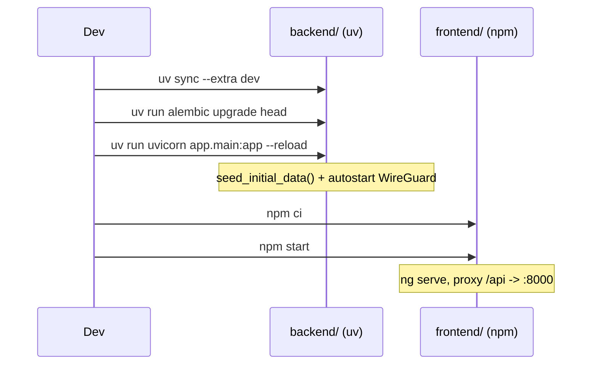

# Installation locale (développement)

Le projet est découpé en deux applications indépendantes qui communiquent via une API REST :

- `backend/` — API FastAPI (Python 3.14+)
- `frontend/` — application Angular (Node.js 22+)

## Prérequis

- **Python 3.14+**
- [**uv**](https://docs.astral.sh/uv/) — gestionnaire de dépendances/environnement Python utilisé par le projet
- **Node.js 22+** et npm
- Les outils WireGuard (`wireguard-tools`, `iptables`) si vous voulez tester les fonctionnalités qui pilotent réellement une interface `wg0` (facultatif pour développer l'UI/API elles-mêmes)

## Étape 1 — Cloner le dépôt

```bash
git clone https://github.com/cyr-ius/wireguard-ui.git
cd wireguard-ui
```

## Étape 2 — (Optionnel) Créer un fichier `.env`

Le backend lit un fichier `.env` à la racine du dépôt via `pydantic-settings` ([config.py](../architecture/backend.md#configpy)). Il n'est pas fourni par défaut (non versionné) — créez-le si vous voulez surcharger les valeurs par défaut :

```env
ADMIN_USERNAME=admin
SECRET_KEY=replace-with-a-long-random-secret
LOG_LEVEL=INFO
```

Sans `SECRET_KEY`, une clé aléatoire est générée automatiquement et stockée dans `DATA_DIR/secret_key` (par défaut `/var/lib/wireguard-ui/secret_key` — pensez à définir `DATA_DIR` en local si ce chemin n'est pas accessible en écriture, voir [Variables d'environnement](variables-environnement.md)).

## Étape 3 — Installer et lancer le backend

```bash
cd backend
uv sync --extra dev
```

Appliquez les migrations de base de données **avant** le premier lancement (elles ne sont pas exécutées automatiquement par `uvicorn`, contrairement à l'image Docker qui le fait via `docker/entrypoint.sh`) :

```bash
uv run alembic upgrade head
```

Puis démarrez le serveur de développement :

```bash
uv run uvicorn app.main:app --reload --host 0.0.0.0 --port 8000
```

!!! note "Commande exécutée depuis `backend/`"
Le module d'entrée est `app.main:app` (et non `src.main:app`) : la commande doit être lancée avec `backend/` comme répertoire courant, comme dans `.vscode/launch.json` et `AGENTS.md`.

Au démarrage (fonction `lifespan` de [main.py](../architecture/backend.md#mainpy)) :

1. `seed_initial_data()` crée les rôles, l'admin initial et les réglages par défaut s'ils n'existent pas encore.
2. Si `WIREGUARD_AUTOSTART` est activé (par défaut), l'application tente d'écrire la configuration WireGuard et de démarrer le service (3 tentatives, 5 s d'intervalle) — cela échouera silencieusement (avec un warning en log) si `wg-quick`/`iptables` ne sont pas disponibles dans votre environnement local, sans bloquer le démarrage de l'API.

L'API est alors disponible sur `http://localhost:8000`, avec la documentation Swagger auto-hébergée sur `http://localhost:8000/api/docs` (si `SWAGGER_ENABLED=true`).

## Étape 4 — Installer et lancer le frontend

Dans un second terminal :

```bash
cd frontend
npm ci
npm start
```

`npm start` exécute `ng serve --host 0.0.0.0`. Angular CLI charge automatiquement `frontend/proxy.conf.json` (déclaré dans `angular.json`, section `serve.options.proxyConfig`), qui redirige les appels `/api/*` vers `http://localhost:8000` :

```json title="frontend/proxy.conf.json"
{
  "/api": {
    "target": "http://localhost:8000",
    "secure": false,
    "changeOrigin": true
  }
}
```

L'interface est accessible sur `http://localhost:4200` et communique avec le backend démarré à l'étape 3.

## Étape 5 — Lancer les deux en une fois (VS Code)

Le dépôt fournit une configuration de debug prête à l'emploi :

- `.vscode/tasks.json` définit les tâches `Backend: alembic upgrade head`, `npm: start - frontend`, etc.
- `.vscode/launch.json` définit la configuration composée **Full Stack**, qui lance le backend (`FastAPI`, avec migration préalable) et le frontend (`Angular`) simultanément.

Dans VS Code : onglet _Run and Debug_ → sélectionner **Full Stack** → F5.

## Vérifications avant une Pull Request

```bash
# Backend
cd backend
uv run ruff check app
uv run ruff format --check app
uv run mypy app

# Frontend
cd ../frontend
npm run build
```

## Résumé des commandes


