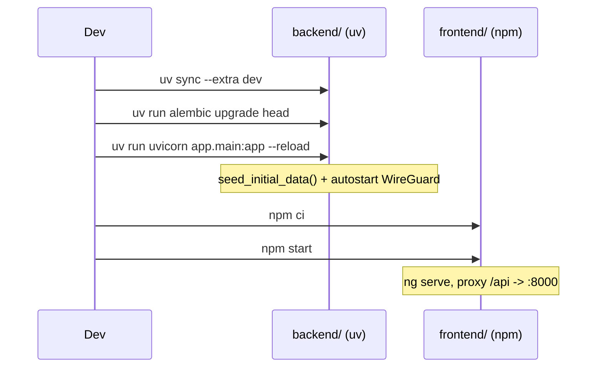

# Local installation (development)

The project is split into two independent applications that communicate via a REST API:

- `backend/` — FastAPI API (Python 3.14+)
- `frontend/` — Angular application (Node.js 22+)

## Prerequisites

- **Python 3.14+**
- [**uv**](https://docs.astral.sh/uv/) — the Python dependency/environment manager used by the project
- **Node.js 22+** and npm
- WireGuard tools (`wireguard-tools`, `iptables`) if you want to test the features that actually drive a `wg0` interface (optional for developing the UI/API themselves)

## Step 1 — Clone the repository

```bash
git clone https://github.com/cyr-ius/wireguard-ui.git
cd wireguard-ui
```

## Step 2 — (Optional) Create a `.env` file

The backend reads a `.env` file at the repository root via `pydantic-settings` ([config.py](../architecture/backend.md#configpy)). It is not provided by default (not versioned) — create it if you want to override the default values:

```env
ADMIN_USERNAME=admin
SECRET_KEY=replace-with-a-long-random-secret
LOG_LEVEL=INFO
```

Without `SECRET_KEY`, a random key is generated automatically and stored in `DATA_DIR/secret_key` (by default `/var/lib/wireguard-ui/secret_key` — set `DATA_DIR` locally if this path is not writable, see [Environment variables](variables-environnement.md)).

## Step 3 — Install and run the backend

```bash
cd backend
uv sync --extra dev
```

Apply database migrations **before** the first launch (they are not run automatically by `uvicorn`, unlike the Docker image, which does so via `docker/entrypoint.sh`):

```bash
uv run alembic upgrade head
```

Then start the development server:

```bash
uv run uvicorn app.main:app --reload --host 0.0.0.0 --port 8000
```

!!! note "Command run from `backend/`"
The entry module is `app.main:app` (not `src.main:app`): the command must be run with `backend/` as the current directory, as in `.vscode/launch.json` and `AGENTS.md`.

On startup (`lifespan` function in [main.py](../architecture/backend.md#mainpy)):

1. `seed_initial_data()` creates the roles, the initial admin, and the default settings if they don't already exist.
2. If `WIREGUARD_AUTOSTART` is enabled (default), the application attempts to write the WireGuard configuration and start the service (3 attempts, 5s apart) — this will fail silently (with a log warning) if `wg-quick`/`iptables` are not available in your local environment, without blocking the API startup.

The API is then available at `http://localhost:8000`, with self-hosted Swagger documentation at `http://localhost:8000/api/docs` (if `SWAGGER_ENABLED=true`).

## Step 4 — Install and run the frontend

In a second terminal:

```bash
cd frontend
npm ci
npm start
```

`npm start` runs `ng serve --host 0.0.0.0`. The Angular CLI automatically loads `frontend/proxy.conf.json` (declared in `angular.json`, `serve.options.proxyConfig` section), which redirects `/api/*` calls to `http://localhost:8000`:

```json title="frontend/proxy.conf.json"
{
  "/api": {
    "target": "http://localhost:8000",
    "secure": false,
    "changeOrigin": true
  }
}
```

The interface is accessible at `http://localhost:4200` and communicates with the backend started in step 3.

## Step 5 — Run both at once (VS Code)

The repository provides a ready-to-use debug configuration:

- `.vscode/tasks.json` defines the `Backend: alembic upgrade head`, `npm: start - frontend`, etc. tasks.
- `.vscode/launch.json` defines the composite **Full Stack** configuration, which launches the backend (`FastAPI`, with a prior migration) and the frontend (`Angular`) simultaneously.

In VS Code: _Run and Debug_ tab → select **Full Stack** → F5.

## Checks before a Pull Request

```bash
# Backend
cd backend
uv run ruff check app
uv run ruff format --check app
uv run mypy app

# Frontend
cd ../frontend
npm run build
```

## Command summary


