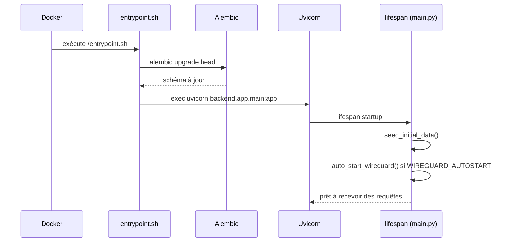

# Docker & Docker Compose

## Image publiée vs build local

Deux façons d'obtenir l'image :

- **Image publiée** : `cyrius44/wireguard-ui:latest` (multi-arch `linux/amd64`/`linux/arm64`) — voir [Démarrage rapide](../demarrage/quickstart-docker.md).
- **Build local** : `docker-compose.yaml` à la racine du dépôt construit l'image depuis le `Dockerfile` local.

```bash
docker compose up -d --build
```

## `Dockerfile` — build multi-stage

### Stage 1 — build du frontend Angular

```dockerfile
FROM node:22-alpine AS frontend-builder
WORKDIR /build/frontend
COPY frontend/package.json ./
RUN npm install
COPY frontend/ ./
RUN npm run build
```

Sortie : `frontend/dist/wireguard-ui/browser`.

### Stage 2 — image finale (backend + assets)

```dockerfile
FROM python:3.14-alpine

RUN apk add --no-cache curl wireguard-tools iptables supervisor ca-certificates

COPY --from=ghcr.io/astral-sh/uv:latest /uv /usr/local/bin/uv
COPY ./docker/entrypoint.sh /entrypoint.sh
RUN chmod +x /entrypoint.sh

WORKDIR /app
RUN --mount=type=bind,source=backend/pyproject.toml,target=pyproject.toml \
    --mount=type=bind,source=backend/uv.lock,target=uv.lock \
    uv sync --frozen --no-dev

COPY --from=frontend-builder /build/frontend/dist/wireguard-ui/browser ./frontend
COPY backend ./backend

HEALTHCHECK --interval=30s --timeout=10s --start-period=15s --retries=3 \
    CMD curl -f http://localhost:8000/api/health || exit 1

VOLUME [ "/etc/wireguard", "/var/lib/wireguard-ui" ]
EXPOSE 8000/tcp 51820/udp
CMD ["/entrypoint.sh"]
```

Points clés :

- **`wireguard-tools`**, **`iptables`** : nécessaires pour que `wg`/`wg-quick` et les règles NAT fonctionnent dans le conteneur.
- **`uv sync --frozen --no-dev`** : installe exactement les dépendances verrouillées dans `uv.lock`, sans les outils de dev (`ruff`, `mypy`…).
- Le build Angular (`./frontend`) et le code backend (`./backend`) sont copiés côte à côte sous `/app`, ce qui correspond à la disposition attendue par `main.py` (`serve_spa` remonte à `parents[2]` puis descend dans `frontend/`).
- **`HEALTHCHECK`** intégré sur `/api/health`.
- Deux volumes déclarés : `/etc/wireguard` (config WireGuard) et `/var/lib/wireguard-ui` (données applicatives).

## `docker/entrypoint.sh`

```sh
#!/bin/sh
set -e

cd /app/backend
alembic upgrade head

cd /app
exec uvicorn backend.app.main:app --host 0.0.0.0 --port 8000 --workers 1
```

C'est **ce script**, et non `main.py`, qui applique les migrations de base de données à chaque démarrage du conteneur — voir [Base de données & migrations](../architecture/base-de-donnees.md#appliquer-les-migrations). `--workers 1` : un seul worker Uvicorn, cohérent avec le rate-limiter et le service WireGuard qui sont gérés **en mémoire, par process** (pas de coordination multi-worker prévue).

## `docker-compose.yaml` (build local)

```yaml
services:
  wireguard-ui:
    build:
      context: .
      dockerfile: Dockerfile
    container_name: wireguard-ui
    restart: unless-stopped
    environment:
      - LOG_LEVEL=${LOG_LEVEL:-INFO}
    volumes:
      - wg_config:/etc/wireguard
      - wg_data:/var/lib/wireguard-ui
    cap_add:
      - NET_ADMIN
    ports:
      - 51820:51820/udp
      - 8000:8000/tcp
    sysctls:
      - net.ipv4.ip_forward=1
      - net.ipv4.conf.all.src_valid_mark=1
volumes:
  wg_config:
  wg_data:
```

!!! tip "Ajouter des variables"
Ce fichier ne définit que `LOG_LEVEL`. Ajoutez `ADMIN_USERNAME`, `SECRET_KEY`, etc. dans la section `environment:`, ou créez un fichier `.env` à côté du `docker-compose.yaml` (Docker Compose le charge automatiquement) — voir [Variables d'environnement](../demarrage/variables-environnement.md).

## Séquence de démarrage du conteneur


