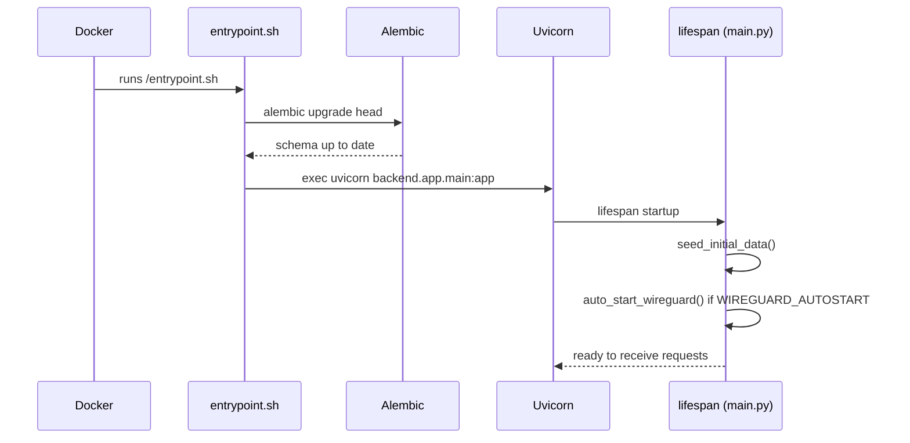

# Docker & Docker Compose

## Published image vs local build

Two ways to obtain the image:

- **Published image**: `cyrius44/wireguard-ui:latest` (multi-arch `linux/amd64`/`linux/arm64`) — see [Quick start](../demarrage/quickstart-docker.md).
- **Local build**: `docker-compose.yaml` at the repository root builds the image from the local `Dockerfile`.

```bash
docker compose up -d --build
```

## `Dockerfile` — multi-stage build

### Stage 1 — Angular frontend build

```dockerfile
FROM node:22-alpine AS frontend-builder
WORKDIR /build/frontend
COPY frontend/package.json ./
RUN npm install
COPY frontend/ ./
RUN npm run build
```

Output: `frontend/dist/wireguard-ui/browser`.

### Stage 2 — final image (backend + assets)

```dockerfile
FROM python:3.14-alpine

RUN apk add --no-cache curl wireguard-tools iptables supervisor ca-certificates

COPY --from=ghcr.io/astral-sh/uv:latest /uv /usr/local/bin/uv
COPY ./docker/entrypoint.sh /entrypoint.sh
RUN chmod +x /entrypoint.sh

WORKDIR /app
RUN --mount=type=bind,source=backend/pyproject.toml,target=pyproject.toml \
    --mount=type=bind,source=backend/uv.lock,target=uv.lock \
    uv sync --frozen --no-dev

COPY --from=frontend-builder /build/frontend/dist/wireguard-ui/browser ./frontend
COPY backend ./backend

HEALTHCHECK --interval=30s --timeout=10s --start-period=15s --retries=3 \
    CMD curl -f http://localhost:8000/api/health || exit 1

VOLUME [ "/etc/wireguard", "/var/lib/wireguard-ui" ]
EXPOSE 8000/tcp 51820/udp
CMD ["/entrypoint.sh"]
```

Key points:

- **`wireguard-tools`**, **`iptables`**: required for `wg`/`wg-quick` and NAT rules to work inside the container.
- **`uv sync --frozen --no-dev`**: installs exactly the dependencies locked in `uv.lock`, without dev tools (`ruff`, `mypy`…).
- The Angular build (`./frontend`) and the backend code (`./backend`) are copied side by side under `/app`, matching the layout expected by `main.py` (`serve_spa` walks up to `parents[2]` then down into `frontend/`).
- Built-in **`HEALTHCHECK`** on `/api/health`.
- Two declared volumes: `/etc/wireguard` (WireGuard config) and `/var/lib/wireguard-ui` (application data).

## `docker/entrypoint.sh`

```sh
#!/bin/sh
set -e

cd /app/backend
alembic upgrade head

cd /app
exec uvicorn backend.app.main:app --host 0.0.0.0 --port 8000 --workers 1
```

It is **this script**, not `main.py`, that applies database migrations on every container startup — see [Database & migrations](../architecture/base-de-donnees.md#applying-migrations). `--workers 1`: a single Uvicorn worker, consistent with the rate-limiter and the WireGuard service, which are managed **in memory, per process** (no multi-worker coordination planned).

## `docker-compose.yaml` (local build)

```yaml
services:
  wireguard-ui:
    build:
      context: .
      dockerfile: Dockerfile
    container_name: wireguard-ui
    restart: unless-stopped
    environment:
      - LOG_LEVEL=${LOG_LEVEL:-INFO}
    volumes:
      - wg_config:/etc/wireguard
      - wg_data:/var/lib/wireguard-ui
    cap_add:
      - NET_ADMIN
    ports:
      - 51820:51820/udp
      - 8000:8000/tcp
    sysctls:
      - net.ipv4.ip_forward=1
      - net.ipv4.conf.all.src_valid_mark=1
volumes:
  wg_config:
  wg_data:
```

!!! tip "Adding variables"
This file only defines `LOG_LEVEL`. Add `ADMIN_USERNAME`, `SECRET_KEY`, etc. in the `environment:` section, or create a `.env` file next to `docker-compose.yaml` (Docker Compose loads it automatically) — see [Environment variables](../demarrage/variables-environnement.md).

## Container startup sequence


