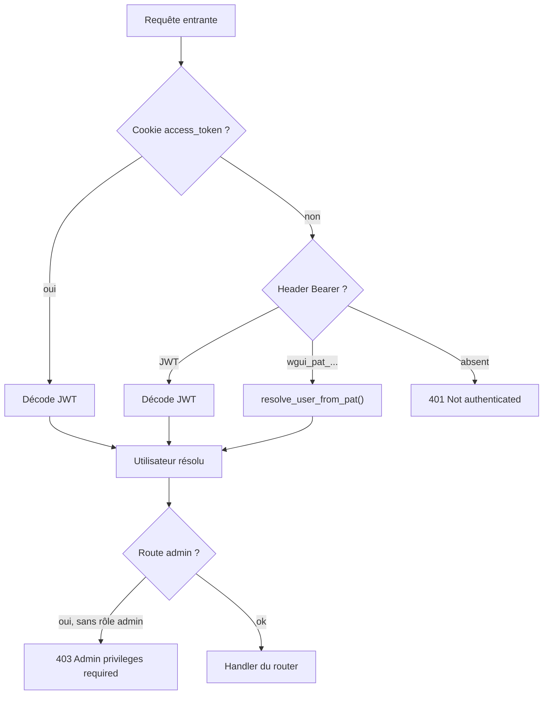

# Authentification & sécurité

WireGuard UI accepte **trois** modes d'authentification simultanément, résolus dans cet ordre par la dépendance `get_current_user` (`backend/app/auth.py`) :

1. **Cookie de session** (`access_token`, JWT, HttpOnly) — utilisé par le frontend Angular (SPA).
2. **Header `Authorization: Bearer <JWT>`** — flux OAuth2 password (`/api/auth/token`), essentiellement pour Swagger UI.
3. **Header `Authorization: Bearer <PAT>`** (préfixe `wgui_pat_...`) — pour les intégrations tierces / scripts.

## Connexion locale

`POST /api/auth/login` (ou `/token` pour le flux OAuth2 Swagger) :

1. `local_login_allowed(db)` vérifie que le mode **OIDC-only** n'est pas actif — sinon `403`.
2. `authenticate_user(db, username, password)` : rejette les comptes `auth_source == "oidc"` (pas de mot de passe local) et vérifie le mot de passe via `verify_password`.
3. `create_access_token({"sub": user.username})` signe un JWT (`HS256`, `SECRET_KEY`, expiration `ACCESS_TOKEN_EXPIRE_MINUTES`).
4. `set_auth_cookies()` pose deux cookies :
   - `access_token` — **HttpOnly**, `SameSite=Lax`, `Secure` si la requête est HTTPS (détecté via `TRUSTED_PROXIES`/`X-Forwarded-Proto`).
   - `csrf_token` — lisible en JS, valeur aléatoire indépendante du JWT.
5. Chaque tentative (réussie ou non) est journalisée (`auth.login` / `auth.login_failed`).

### Hachage des mots de passe

- `bcrypt`, avec un coût configurable (`BCRYPT_ROUNDS`, défaut 12).
- Pré-hash SHA-256 + base64 du mot de passe avant `bcrypt` (`_bcrypt_input`), pour contourner la limite de 72 octets de bcrypt sans tronquer silencieusement les mots de passe longs.
- `verify_password()` reste compatible avec d'anciens hash bcrypt "bruts" (sans le pré-hash SHA-256), pour ne pas invalider les mots de passe existants après une migration de schéma de hachage.

## Protection CSRF

Cookies en double soumission (_double-submit cookie_) : sur toute méthode non sûre (`POST`/`PUT`/`PATCH`/`DELETE`) d'une route `/api/*` authentifiée **par cookie**, `CsrfMiddleware` exige que le header `X-CSRF-Token` corresponde exactement (`secrets.compare_digest`) au cookie `csrf_token`. Les requêtes authentifiées uniquement par header `Bearer` (sans cookie de session) ne sont pas concernées — elles ne sont pas vulnérables au CSRF.

## Rate limiting

`RateLimitMiddleware` applique une fenêtre glissante par IP (`SlidingWindowRateLimiter`) sur tout `/api/*` (hors `/api/health`) :

- Seuil global : `RATE_LIMIT_MAX_REQUESTS` requêtes / `RATE_LIMIT_WINDOW_SECONDS`.
- Seuil renforcé sur `/api/auth/login` et `/api/auth/token` : `RATE_LIMIT_AUTH_MAX_REQUESTS` (plus bas, pour freiner le brute-force).
- L'IP utilisée est celle résolue par `client_ip(request)` (`proxy.py`), qui ne fait confiance à `X-Forwarded-For` que si l'appelant figure dans `TRUSTED_PROXIES`.

!!! note "Limite d'implémentation"
Le compteur est **en mémoire**, adapté au déploiement mono-worker de l'image fournie. Pour du multi-process ou multi-réplica, il faudrait un store partagé (Redis).

## En-têtes de sécurité

`SecurityHeadersMiddleware` ajoute à chaque réponse : `X-Content-Type-Options: nosniff`, `X-Frame-Options: DENY`, `Referrer-Policy: strict-origin-when-cross-origin`, `Permissions-Policy` restrictive, `Strict-Transport-Security`, et une **Content-Security-Policy** stricte (`frame-ancestors 'none'`, pas de CDN externe — Swagger UI est auto-hébergé pour cette raison).

## OIDC (Single Sign-On)

Flux _authorization code_, implémenté dans `services/oidc.py` :

1. Le frontend récupère la config publique (`GET /api/oidc/config`), qui inclut les endpoints `authorization`/`end_session` résolus via le **document de découverte** (`{issuer}/.well-known/openid-configuration`).
2. L'utilisateur est redirigé vers l'IdP, revient sur `/auth/callback?code=...`.
3. `POST /api/oidc/callback` → `exchange_code()` :
   - Échange le `code` contre un jeu de tokens à l'endpoint `token_endpoint` (méthode d'authentification client négociée automatiquement : `client_secret_basic`, `client_secret_post`, ou `none`, selon `token_endpoint_auth_methods_supported`).
   - Récupère les claims d'identité soit via l'**endpoint userinfo** (si disponible), soit en **vérifiant cryptographiquement** l'`id_token` (signature JWKS, audience, issuer) via `verify_id_token()`.
4. `find_or_create_user()` provisionne l'utilisateur :
   - Recherche un compte OIDC existant (`auth_source == "oidc"`) par username/email.
   - **Anti-usurpation** : `local_account_conflict()` refuse (`403`) de connecter une identité OIDC dont le username/email correspond à un compte **local** existant — empêche un IdP compromis ou mal configuré de prendre le contrôle du compte admin local.
   - À défaut, crée un nouvel utilisateur `auth_source="oidc"` avec le rôle `user` par défaut, un mot de passe local aléatoire inutilisable (`uuid4().hex` haché), et un username unique (`generate_unique_username`).
   - À chaque connexion suivante, `sync_oidc_user()` resynchronise `first_name`/`last_name`/`email` depuis les claims (l'email n'est mis à jour que s'il est libre, pour ne pas violer la contrainte d'unicité).
5. Un JWT applicatif standard est émis ensuite exactement comme pour une connexion locale.

**Mode OIDC-only** (`OidcSettings.oidc_only=True`) : désactive complètement `/api/auth/login` et `/api/auth/token` (`local_login_allowed()` renvoie `False`). Impossible à activer sans que `enabled=True` également (vérifié côté API).

## Personal Access Tokens (PAT)

- Chaque utilisateur gère ses propres tokens (`/api/pat`, pas de restriction admin), désactivable globalement via `API_KEYS_ENABLED`.
- Format : `wgui_pat_<32 octets aléatoires en base64 URL-safe>`.
- Seul le **hash SHA-256** est stocké (`token_hash`) — le token en clair n'est **jamais** récupérable après sa création (`PatCreateResponse`).
- Durées disponibles : `7d`, `30d`, `90d`, `1y`, `unlimited`.
- `resolve_user_from_pat()` vérifie la non-expiration et la non-révocation à chaque requête, et met à jour `last_used_at`.

## Comptes administrateurs — garde-fous

Pour ne jamais se retrouver sans administrateur actif, plusieurs vérifications s'appliquent (`services/users.py`) :

- Impossible de supprimer son **propre** compte (`users.py`, `delete_user`).
- Impossible de désactiver, supprimer ou retirer le rôle `admin` au **dernier** administrateur actif (`ensure_not_last_active_admin` / logique dédiée dans `update_user`).

## Journal d'audit

Toute action sensible (connexion, échec de connexion, déconnexion, changement de mot de passe, CRUD clients/serveur/réglages/utilisateurs, gestion PAT) est journalisée via `services/audit.py`, avec IP source, acteur, cible et succès/échec. Rétention configurable (`AUDIT_RETENTION_DAYS`, `AUDIT_MAX_EVENTS`) — voir [Routers → `audit.py`](routers.md#auditpy-apiaudit-admin-lecture-seule).
