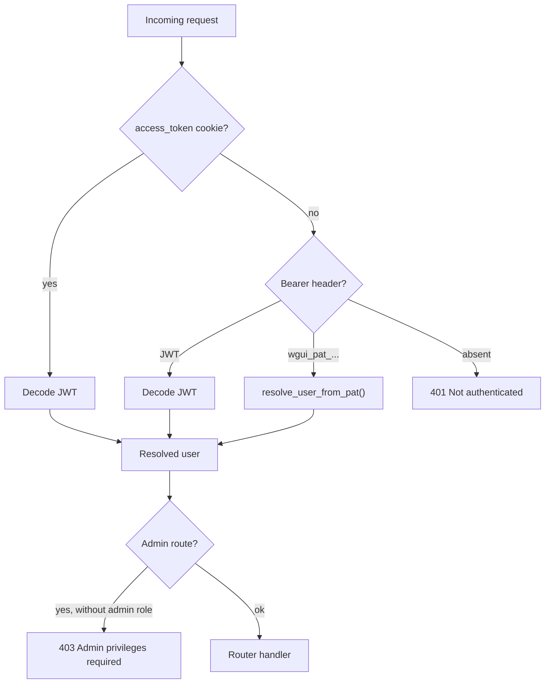

# Authentication & security

WireGuard UI accepts **three** authentication modes simultaneously, resolved in this order by the `get_current_user` dependency (`backend/app/auth.py`):

1. **Session cookie** (`access_token`, JWT, HttpOnly) — used by the Angular frontend (SPA).
2. **`Authorization: Bearer <JWT>` header** — OAuth2 password flow (`/api/auth/token`), mainly for Swagger UI.
3. **`Authorization: Bearer <PAT>` header** (`wgui_pat_...` prefix) — for third-party integrations / scripts.

## Local login

`POST /api/auth/login` (or `/token` for the Swagger OAuth2 flow):

1. `local_login_allowed(db)` checks that **OIDC-only** mode is not active — otherwise `403`.
2. `authenticate_user(db, username, password)`: rejects `auth_source == "oidc"` accounts (no local password) and verifies the password via `verify_password`.
3. `create_access_token({"sub": user.username})` signs a JWT (`HS256`, `SECRET_KEY`, `ACCESS_TOKEN_EXPIRE_MINUTES` expiration).
4. `set_auth_cookies()` sets two cookies:
   - `access_token` — **HttpOnly**, `SameSite=Lax`, `Secure` if the request is HTTPS (detected via `TRUSTED_PROXIES`/`X-Forwarded-Proto`).
   - `csrf_token` — JS-readable, random value independent of the JWT.
5. Every attempt (successful or not) is logged (`auth.login` / `auth.login_failed`).

### Password hashing

- `bcrypt`, with a configurable cost (`BCRYPT_ROUNDS`, default 12).
- SHA-256 + base64 pre-hash of the password before `bcrypt` (`_bcrypt_input`), to work around bcrypt's 72-byte limit without silently truncating long passwords.
- `verify_password()` remains compatible with older "raw" bcrypt hashes (without the SHA-256 pre-hash), so as not to invalidate existing passwords after a hashing scheme migration.

## CSRF protection

Double-submit cookie: for any unsafe method (`POST`/`PUT`/`PATCH`/`DELETE`) on a `/api/*` route authenticated **by cookie**, `CsrfMiddleware` requires the `X-CSRF-Token` header to exactly match (`secrets.compare_digest`) the `csrf_token` cookie. Requests authenticated only by a `Bearer` header (no session cookie) are not affected — they are not vulnerable to CSRF.

## Rate limiting

`RateLimitMiddleware` applies a per-IP sliding window (`SlidingWindowRateLimiter`) on every `/api/*` route (except `/api/health`):

- Global threshold: `RATE_LIMIT_MAX_REQUESTS` requests / `RATE_LIMIT_WINDOW_SECONDS`.
- Stricter threshold on `/api/auth/login` and `/api/auth/token`: `RATE_LIMIT_AUTH_MAX_REQUESTS` (lower, to slow down brute-force attempts).
- The IP used is the one resolved by `client_ip(request)` (`proxy.py`), which only trusts `X-Forwarded-For` if the caller is listed in `TRUSTED_PROXIES`.

!!! note "Implementation limitation"
The counter is **in-memory**, suited to the single-worker deployment of the provided image. For multi-process or multi-replica setups, a shared store (Redis) would be needed.

## Security headers

`SecurityHeadersMiddleware` adds to every response: `X-Content-Type-Options: nosniff`, `X-Frame-Options: DENY`, `Referrer-Policy: strict-origin-when-cross-origin`, a restrictive `Permissions-Policy`, `Strict-Transport-Security`, and a strict **Content-Security-Policy** (`frame-ancestors 'none'`, no external CDN — Swagger UI is self-hosted for this reason).

## OIDC (Single Sign-On)

_Authorization code_ flow, implemented in `services/oidc.py`:

1. The frontend fetches the public config (`GET /api/oidc/config`), which includes the `authorization`/`end_session` endpoints resolved via the **discovery document** (`{issuer}/.well-known/openid-configuration`).
2. The user is redirected to the IdP, and returns to `/auth/callback?code=...`.
3. `POST /api/oidc/callback` → `exchange_code()`:
   - Exchanges the `code` for a set of tokens at the `token_endpoint` (client authentication method negotiated automatically: `client_secret_basic`, `client_secret_post`, or `none`, based on `token_endpoint_auth_methods_supported`).
   - Retrieves identity claims either via the **userinfo endpoint** (if available), or by **cryptographically verifying** the `id_token` (JWKS signature, audience, issuer) via `verify_id_token()`.
4. `find_or_create_user()` provisions the user:
   - Looks for an existing OIDC account (`auth_source == "oidc"`) by username/email.
   - **Anti-spoofing**: `local_account_conflict()` refuses (`403`) to log in an OIDC identity whose username/email matches an existing **local** account — prevents a compromised or misconfigured IdP from taking over the local admin account.
   - Otherwise, creates a new `auth_source="oidc"` user with the default `user` role, an unusable random local password (hashed `uuid4().hex`), and a unique username (`generate_unique_username`).
   - On every subsequent login, `sync_oidc_user()` resynchronizes `first_name`/`last_name`/`email` from the claims (the email is only updated if it's free, so as not to violate the uniqueness constraint).
5. A standard application JWT is then issued exactly as for a local login.

**OIDC-only mode** (`OidcSettings.oidc_only=True`): completely disables `/api/auth/login` and `/api/auth/token` (`local_login_allowed()` returns `False`). Cannot be enabled without `enabled=True` also being set (checked API-side).

## Personal Access Tokens (PAT)

- Each user manages their own tokens (`/api/pat`, no admin restriction), can be globally disabled via `API_KEYS_ENABLED`.
- Format: `wgui_pat_<32 random bytes, URL-safe base64>`.
- Only the **SHA-256 hash** is stored (`token_hash`) — the raw token is **never** retrievable after creation (`PatCreateResponse`).
- Available durations: `7d`, `30d`, `90d`, `1y`, `unlimited`.
- `resolve_user_from_pat()` checks non-expiration and non-revocation on every request, and updates `last_used_at`.

## Administrator accounts — safeguards

To never end up without an active administrator, several checks apply (`services/users.py`):

- Impossible to delete **your own** account (`users.py`, `delete_user`).
- Impossible to deactivate, delete, or remove the `admin` role from the **last** active administrator (`ensure_not_last_active_admin` / dedicated logic in `update_user`).

## Audit log

Every sensitive action (login, failed login, logout, password change, client/server/settings/user CRUD, PAT management) is logged via `services/audit.py`, with source IP, actor, target, and success/failure. Configurable retention (`AUDIT_RETENTION_DAYS`, `AUDIT_MAX_EVENTS`) — see [Routers → `audit.py`](routers.md#auditpy-apiaudit-admin-read-only).
