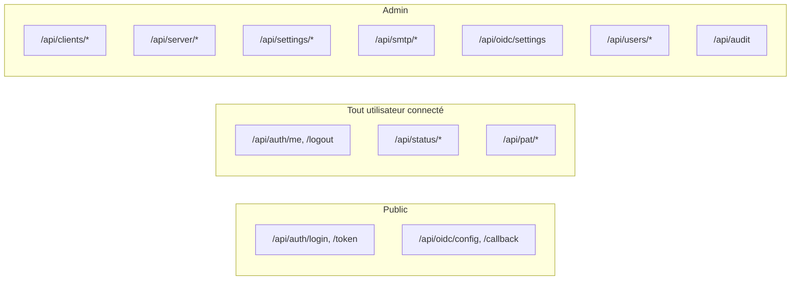

# Routers (endpoints API)

Chaque router vit dans `backend/app/routers/` et est monté dans [`main.py`](../architecture/backend.md#5-routers) sous un préfixe `/api/<domaine>`. Sauf mention contraire, toutes les routes admin nécessitent la dépendance `get_current_admin` ([Authentification & sécurité](authentification.md)).

## `auth.py` — `/api/auth`

| Méthode | Route              | Accès       | Description                                                                                                |
| ------- | ------------------ | ----------- | ---------------------------------------------------------------------------------------------------------- |
| `POST`  | `/token`           | Public      | Flux OAuth2 _password_ (formulaire) utilisé par Swagger UI.                                                |
| `POST`  | `/login`           | Public      | Connexion JSON (`{username, password}`) — pose les cookies `access_token` (JWT, HttpOnly) et `csrf_token`. |
| `POST`  | `/logout`          | Authentifié | Efface les cookies de session, journalise l'événement si l'utilisateur était identifié.                    |
| `GET`   | `/me`              | Authentifié | Profil de l'utilisateur courant.                                                                           |
| `GET`   | `/config`          | Authentifié | Feature flags exposés au frontend (ex. `api_keys_enabled`).                                                |
| `POST`  | `/change-password` | Authentifié | Change le mot de passe (refusé pour les comptes `oidc`).                                                   |

Les connexions locales sont refusées avec `403` si `local_login_allowed()` renvoie faux (mode **OIDC-only** activé). Chaque tentative de connexion, réussie ou non, est journalisée via [`services/audit.py`](services.md#auditpy).

## `clients.py` — `/api/clients` (admin)

| Méthode  | Route                     | Description                                                                                                                                                                                                             |
| -------- | ------------------------- | ----------------------------------------------------------------------------------------------------------------------------------------------------------------------------------------------------------------------- |
| `GET`    | `/`                       | Liste tous les pairs, triés par nom.                                                                                                                                                                                    |
| `POST`   | `/`                       | Crée un pair : vérifie l'unicité (nom/email/IP), génère une paire de clés WireGuard, réécrit `wg0.conf` et applique un _hot reload_ (`reload_peers`), envoie optionnellement l'email de configuration en tâche de fond. |
| `GET`    | `/suggest-ip`             | Renvoie la prochaine IP libre du réseau du serveur ([`services/ip_suggestion.py`](services.md#ip_suggestionpy)).                                                                                                        |
| `GET`    | `/utils/keypair`          | Génère une paire de clés WireGuard à la volée.                                                                                                                                                                          |
| `GET`    | `/utils/machine-ips`      | Liste les IP non-loopback de la machine hôte.                                                                                                                                                                           |
| `GET`    | `/{client_id}`            | Détail d'un pair.                                                                                                                                                                                                       |
| `PATCH`  | `/{client_id}`            | Mise à jour partielle ; réapplique la config serveur + hot reload.                                                                                                                                                      |
| `DELETE` | `/{client_id}`            | Supprime le pair et retire son entrée de la configuration active.                                                                                                                                                       |
| `GET`    | `/{client_id}/config`     | Génère le fichier `.conf` du client et son QR code (base64).                                                                                                                                                            |
| `POST`   | `/{client_id}/send-email` | Planifie l'envoi de la configuration par email, dans la langue demandée.                                                                                                                                                |

Toutes les mutations (`POST`/`PATCH`/`DELETE`) sont journalisées (`client.created`, `client.updated`, `client.deleted`) et déclenchent une réécriture de la configuration WireGuard via [`services/wireguard.py`](services.md#wireguardpy).

## `server.py` — `/api/server` (admin)

| Méthode  | Route               | Description                                                                                                   |
| -------- | ------------------- | ------------------------------------------------------------------------------------------------------------- |
| `GET`    | `/`                 | Configuration serveur actuelle (`404` si non configuré).                                                      |
| `PUT`    | `/`                 | Crée ou remplace la configuration (adresse, port, clés, règles `PostUp`/`PostDown`), puis réécrit `wg0.conf`. |
| `DELETE` | `/`                 | Supprime la configuration serveur enregistrée.                                                                |
| `POST`   | `/keypair`          | Génère une nouvelle paire de clés serveur.                                                                    |
| `POST`   | `/apply`            | Réécrit la config sur disque et **redémarre** le service WireGuard.                                           |
| `POST`   | `/service/{action}` | `start`, `stop` ou `restart` du service (`wg-quick`).                                                         |

## `settings.py` — `/api/settings` (admin)

Réglages globaux du VPN (`GlobalSettings`, ligne unique) : adresse d'`endpoint`, serveurs DNS, MTU, `PersistentKeepalive`, mode maintenance.

| Méthode  | Route    | Description                                                      |
| -------- | -------- | ---------------------------------------------------------------- |
| `GET`    | `/`      | Réglages actuels (créés avec des valeurs par défaut si absents). |
| `PATCH`  | `/`      | Mise à jour partielle.                                           |
| `DELETE` | `/reset` | Réinitialise aux valeurs par défaut.                             |

## `smtp.py` — `/api/smtp` (admin)

| Méthode  | Route    | Description                                                                    |
| -------- | -------- | ------------------------------------------------------------------------------ |
| `GET`    | `/`      | Configuration SMTP (le mot de passe n'est **jamais** renvoyé).                 |
| `PUT`    | `/`      | Met à jour la configuration ; conserve le mot de passe existant si non fourni. |
| `DELETE` | `/reset` | Réinitialise aux valeurs par défaut.                                           |
| `POST`   | `/test`  | Envoie un email de test en tâche de fond vers un destinataire donné.           |

## `oidc.py` — `/api/oidc`

| Méthode  | Route       | Accès  | Description                                                                                                                       |
| -------- | ----------- | ------ | --------------------------------------------------------------------------------------------------------------------------------- |
| `GET`    | `/settings` | Admin  | Réglages OIDC complets (dont `client_secret`).                                                                                    |
| `PUT`    | `/settings` | Admin  | Met à jour les réglages ; refuse `oidc_only=true` si `enabled=false`.                                                             |
| `GET`    | `/config`   | Public | Config OIDC publique (sans secret), enrichie des endpoints `authorization`/`end_session` via la _discovery document_ de l'issuer. |
| `POST`   | `/callback` | Public | Échange le `code` d'autorisation contre un JWT applicatif (voir [`services/oidc.py`](services.md#oidcpy)).                        |
| `DELETE` | `/reset`    | Admin  | Réinitialise les réglages OIDC.                                                                                                   |

## `users.py` — `/api/users` (admin)

| Méthode  | Route          | Description                                                                   |
| -------- | -------------- | ----------------------------------------------------------------------------- |
| `GET`    | `/`            | Liste tous les utilisateurs (avec leurs rôles).                               |
| `GET`    | `/utils/roles` | Liste les rôles disponibles.                                                  |
| `POST`   | `/`            | Crée un utilisateur (vérifie l'unicité username/email, hash du mot de passe). |
| `GET`    | `/{user_id}`   | Détail d'un utilisateur.                                                      |
| `PATCH`  | `/{user_id}`   | Mise à jour partielle.                                                        |
| `DELETE` | `/{user_id}`   | Supprime un utilisateur.                                                      |

Garde-fous importants :

- Un compte **OIDC** (`auth_source != "local"`) ne peut pas voir son email, nom ou mot de passe modifiés depuis cette API (gérés par l'IdP) — seuls les rôles et le statut `active` restent modifiables.
- Impossible de **désactiver ou rétrograder le dernier administrateur actif** (`ensure_not_last_active_admin` / vérification dans `update_user`).
- Impossible de **supprimer son propre compte** (`delete_user`).

## `audit.py` — `/api/audit` (admin, lecture seule)

| Méthode | Route | Description                                                                                                           |
| ------- | ----- | --------------------------------------------------------------------------------------------------------------------- |
| `GET`   | `/`   | Liste paginée du journal d'audit (`limit`, `offset`, filtre optionnel `action`), triée du plus récent au plus ancien. |

## `pat.py` — `/api/pat` (utilisateur connecté)

Gestion des **Personal Access Tokens**, propres à chaque utilisateur (pas admin-only : chacun gère ses propres tokens). Désactivable globalement via `API_KEYS_ENABLED`.

| Méthode  | Route         | Description                                                                  |
| -------- | ------------- | ---------------------------------------------------------------------------- |
| `GET`    | `/`           | Liste les tokens de l'utilisateur courant (jamais la valeur brute).          |
| `POST`   | `/`           | Émet un nouveau token — la valeur brute n'est renvoyée **qu'à la création**. |
| `DELETE` | `/{token_id}` | Révoque un token.                                                            |

## `status.py` — `/api/status` (tout utilisateur connecté)

Seul router accessible aux utilisateurs non-admin en dehors de `profile`/`about`.

| Méthode | Route             | Description                                                                                        |
| ------- | ----------------- | -------------------------------------------------------------------------------------------------- |
| `GET`   | `/`               | État runtime WireGuard (pairs connectés, trafic) via `wg show`.                                    |
| `GET`   | `/version`        | Version de l'application (`APP_VERSION`).                                                          |
| `GET`   | `/latest-release` | Proxy vers l'API GitHub (`releases/latest`) pour contourner les restrictions CORS côté navigateur. |

## Vue d'ensemble

