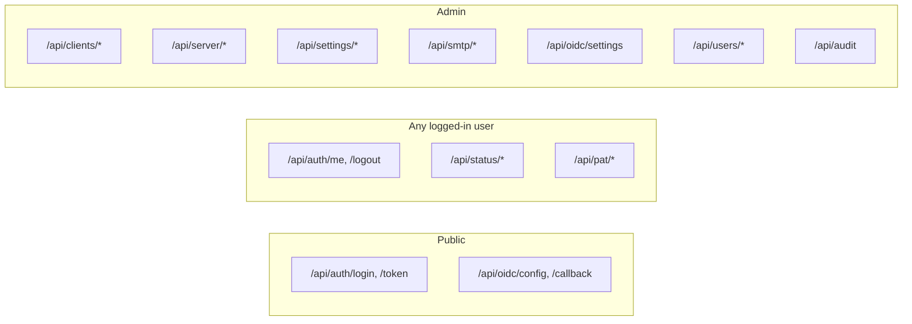

# Routers (API endpoints)

Each router lives in `backend/app/routers/` and is mounted in [`main.py`](../architecture/backend.md#5-routers) under an `/api/<domain>` prefix. Unless stated otherwise, all admin routes require the `get_current_admin` dependency ([Authentication & security](authentification.md)).

## `auth.py` — `/api/auth`

| Method | Route              | Access        | Description                                                                                             |
| ------ | ------------------ | ------------- | ------------------------------------------------------------------------------------------------------- |
| `POST` | `/token`           | Public        | OAuth2 _password_ flow (form) used by Swagger UI.                                                       |
| `POST` | `/login`           | Public        | JSON login (`{username, password}`) — sets the `access_token` (JWT, HttpOnly) and `csrf_token` cookies. |
| `POST` | `/logout`          | Authenticated | Clears session cookies, logs the event if the user was identified.                                      |
| `GET`  | `/me`              | Authenticated | Current user's profile.                                                                                 |
| `GET`  | `/config`          | Authenticated | Feature flags exposed to the frontend (e.g. `api_keys_enabled`).                                        |
| `POST` | `/change-password` | Authenticated | Changes the password (rejected for `oidc` accounts).                                                    |

Local logins are rejected with `403` if `local_login_allowed()` returns false (**OIDC-only** mode enabled). Every login attempt, successful or not, is logged via [`services/audit.py`](services.md#auditpy).

## `clients.py` — `/api/clients` (admin)

| Method   | Route                     | Description                                                                                                                                                                                                        |
| -------- | ------------------------- | ------------------------------------------------------------------------------------------------------------------------------------------------------------------------------------------------------------------ |
| `GET`    | `/`                       | Lists all peers, sorted by name.                                                                                                                                                                                   |
| `POST`   | `/`                       | Creates a peer: checks uniqueness (name/email/IP), generates a WireGuard key pair, rewrites `wg0.conf` and applies a _hot reload_ (`reload_peers`), optionally sends the configuration email as a background task. |
| `GET`    | `/suggest-ip`             | Returns the next free IP in the server's network ([`services/ip_suggestion.py`](services.md#ip_suggestionpy)).                                                                                                     |
| `GET`    | `/utils/keypair`          | Generates a WireGuard key pair on the fly.                                                                                                                                                                         |
| `GET`    | `/utils/machine-ips`      | Lists the non-loopback IPs of the host machine.                                                                                                                                                                    |
| `GET`    | `/{client_id}`            | Details of a peer.                                                                                                                                                                                                 |
| `PATCH`  | `/{client_id}`            | Partial update; reapplies the server config + hot reload.                                                                                                                                                          |
| `DELETE` | `/{client_id}`            | Deletes the peer and removes its entry from the active configuration.                                                                                                                                              |
| `GET`    | `/{client_id}/config`     | Generates the client's `.conf` file and its QR code (base64).                                                                                                                                                      |
| `POST`   | `/{client_id}/send-email` | Schedules sending the configuration by email, in the requested language.                                                                                                                                           |

All mutations (`POST`/`PATCH`/`DELETE`) are logged (`client.created`, `client.updated`, `client.deleted`) and trigger a rewrite of the WireGuard configuration via [`services/wireguard.py`](services.md#wireguardpy).

## `server.py` — `/api/server` (admin)

| Method   | Route               | Description                                                                                                       |
| -------- | ------------------- | ----------------------------------------------------------------------------------------------------------------- |
| `GET`    | `/`                 | Current server configuration (`404` if not configured).                                                           |
| `PUT`    | `/`                 | Creates or replaces the configuration (address, port, keys, `PostUp`/`PostDown` rules), then rewrites `wg0.conf`. |
| `DELETE` | `/`                 | Deletes the saved server configuration.                                                                           |
| `POST`   | `/keypair`          | Generates a new server key pair.                                                                                  |
| `POST`   | `/apply`            | Rewrites the config to disk and **restarts** the WireGuard service.                                               |
| `POST`   | `/service/{action}` | `start`, `stop` or `restart` of the service (`wg-quick`).                                                         |

## `settings.py` — `/api/settings` (admin)

Global VPN settings (`GlobalSettings`, single row): `endpoint` address, DNS servers, MTU, `PersistentKeepalive`, maintenance mode.

| Method   | Route    | Description                                               |
| -------- | -------- | --------------------------------------------------------- |
| `GET`    | `/`      | Current settings (created with default values if absent). |
| `PATCH`  | `/`      | Partial update.                                           |
| `DELETE` | `/reset` | Resets to default values.                                 |

## `smtp.py` — `/api/smtp` (admin)

| Method   | Route    | Description                                                             |
| -------- | -------- | ----------------------------------------------------------------------- |
| `GET`    | `/`      | SMTP configuration (the password is **never** returned).                |
| `PUT`    | `/`      | Updates the configuration; keeps the existing password if not provided. |
| `DELETE` | `/reset` | Resets to default values.                                               |
| `POST`   | `/test`  | Sends a test email as a background task to a given recipient.           |

## `oidc.py` — `/api/oidc`

| Method   | Route       | Access | Description                                                                                                                       |
| -------- | ----------- | ------ | --------------------------------------------------------------------------------------------------------------------------------- |
| `GET`    | `/settings` | Admin  | Full OIDC settings (including `client_secret`).                                                                                   |
| `PUT`    | `/settings` | Admin  | Updates the settings; rejects `oidc_only=true` if `enabled=false`.                                                                |
| `GET`    | `/config`   | Public | Public OIDC config (without secret), enriched with `authorization`/`end_session` endpoints via the issuer's _discovery document_. |
| `POST`   | `/callback` | Public | Exchanges the authorization `code` for an application JWT (see [`services/oidc.py`](services.md#oidcpy)).                         |
| `DELETE` | `/reset`    | Admin  | Resets the OIDC settings.                                                                                                         |

## `users.py` — `/api/users` (admin)

| Method   | Route          | Description                                                             |
| -------- | -------------- | ----------------------------------------------------------------------- |
| `GET`    | `/`            | Lists all users (with their roles).                                     |
| `GET`    | `/utils/roles` | Lists available roles.                                                  |
| `POST`   | `/`            | Creates a user (checks username/email uniqueness, hashes the password). |
| `GET`    | `/{user_id}`   | Details of a user.                                                      |
| `PATCH`  | `/{user_id}`   | Partial update.                                                         |
| `DELETE` | `/{user_id}`   | Deletes a user.                                                         |

Important safeguards:

- An **OIDC** account (`auth_source != "local"`) cannot have its email, name, or password changed via this API (managed by the IdP) — only roles and the `active` status remain editable.
- Impossible to **deactivate or demote the last active administrator** (`ensure_not_last_active_admin` / check in `update_user`).
- Impossible to **delete your own account** (`delete_user`).

## `audit.py` — `/api/audit` (admin, read-only)

| Method | Route | Description                                                                                                       |
| ------ | ----- | ----------------------------------------------------------------------------------------------------------------- |
| `GET`  | `/`   | Paginated list of the audit log (`limit`, `offset`, optional `action` filter), sorted from most recent to oldest. |

## `pat.py` — `/api/pat` (logged-in user)

Management of **Personal Access Tokens**, per user (not admin-only: everyone manages their own tokens). Can be globally disabled via `API_KEYS_ENABLED`.

| Method   | Route         | Description                                                          |
| -------- | ------------- | -------------------------------------------------------------------- |
| `GET`    | `/`           | Lists the current user's tokens (never the raw value).               |
| `POST`   | `/`           | Issues a new token — the raw value is returned **only at creation**. |
| `DELETE` | `/{token_id}` | Revokes a token.                                                     |

## `status.py` — `/api/status` (any logged-in user)

The only router accessible to non-admin users besides `profile`/`about`.

| Method | Route             | Description                                                                                |
| ------ | ----------------- | ------------------------------------------------------------------------------------------ |
| `GET`  | `/`               | Runtime WireGuard status (connected peers, traffic) via `wg show`.                         |
| `GET`  | `/version`        | Application version (`APP_VERSION`).                                                       |
| `GET`  | `/latest-release` | Proxy to the GitHub API (`releases/latest`) to work around browser-side CORS restrictions. |

## Overview

