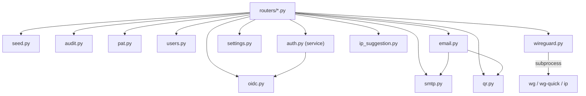

# Services métier (`backend/app/services/`)

Les services contiennent la logique réutilisable, indépendante de la couche HTTP. Les routers les orchestrent mais n'implémentent jamais eux-mêmes la logique métier.

## `wireguard.py`

Toutes les interactions avec les outils système WireGuard (`wg`, `wg-quick`) et réseau (`ip`).

| Fonction                                                   | Rôle                                                                                                                                                                                                                                |
| ---------------------------------------------------------- | ----------------------------------------------------------------------------------------------------------------------------------------------------------------------------------------------------------------------------------- |
| `_run(*args, stdin=None)`                                  | Exécute une commande **sans shell** (`create_subprocess_exec`), pour qu'aucune valeur dérivée d'une entrée utilisateur (clé, nom, IP) ne puisse être interprétée par un shell. Lève `WireGuardError` en cas de code retour non nul. |
| `generate_keypair()`                                       | `wg genkey` + `wg pubkey` → paire de clés privée/publique.                                                                                                                                                                          |
| `get_service_state()`                                      | `running`/`stopped`, déduit de `wg showconf`.                                                                                                                                                                                       |
| `start_service()` / `stop_service()` / `restart_service()` | Pilotent l'interface via `wg-quick up/down`.                                                                                                                                                                                        |
| `add_peer()` / `remove_peer()`                             | Ajoute/retire un pair **sans redémarrage** de l'interface (`wg set ... peer ...`), avec ajustement de la route associée.                                                                                                            |
| `reload_peers()`                                           | Recharge la liste des pairs à chaud (`wg-quick strip` + `wg syncconf`), sans couper les connexions existantes — utilisé après chaque création/modification/suppression de client.                                                   |
| `get_status()`                                             | Parse la sortie de `wg show` en structure exploitable par l'API (`état`, pairs, transfert, dernier handshake).                                                                                                                      |
| `build_client_config()`                                    | Génère le contenu textuel du fichier `.conf` d'un client (`[Interface]`/`[Peer]`), à partir du client, du serveur et des réglages globaux.                                                                                          |
| `build_server_config()`                                    | Génère le contenu de `wg0.conf` côté serveur, incluant tous les pairs **actifs** (`enabled=True`).                                                                                                                                  |
| `write_server_config()`                                    | Écrit `build_server_config()` sur disque (`/etc/wireguard/wg0.conf`), dans un exécuteur pour ne pas bloquer la boucle asyncio.                                                                                                      |
| `get_machine_ips()`                                        | Liste les IP non-loopback de la machine hôte (`ip -j address show`, avec repli sur `socket.getaddrinfo`).                                                                                                                           |

## `seed.py`

`seed_initial_data()` — appelé à **chaque démarrage** de l'application (voir [lifespan](../architecture/backend.md#4-cycle-de-vie-lifespan)), idempotent :

1. `_seed_roles()` : crée les rôles `admin` (`admin-read,admin-write,user-read,user-write`) et `user` (`user-read,user-write`) s'ils n'existent pas.
2. `_seed_admin()` : **uniquement si aucun utilisateur n'existe encore**, crée le compte admin (`ADMIN_USERNAME`/`ADMIN_EMAIL`) avec un mot de passe aléatoire (`secrets.token_urlsafe(16)`), affiché **une seule fois** dans les logs (niveau `WARNING`).
3. `_seed_settings()` / `_seed_oidc_settings()` / `_seed_smtp_settings()` : créent les lignes de réglages par défaut si absentes.

## `audit.py`

- **`log_event(db, action, *, actor=None, target=None, details=None, request=None, success=True)`** : insère un événement (`AuditLog`) et **commite immédiatement**, indépendamment de la transaction de l'appelant — pour que l'événement soit enregistré même si l'action elle-même échoue ensuite. `actor` peut être un objet `User` (son `username` est extrait) ou une chaîne brute (utile pour journaliser un échec de connexion avec un nom d'utilisateur invalide).
- **`_prune(db)`** : appelée après chaque insertion. Supprime les événements plus anciens que `AUDIT_RETENTION_DAYS`, puis, si le nombre total dépasse encore `AUDIT_MAX_EVENTS`, supprime les plus anciens en excès.

Actions journalisées dans le code : `auth.login`, `auth.login_failed`, `auth.logout`, `auth.password_changed`, `client.created/updated/deleted`, `server.updated/reset/apply/service.<action>`, `global_settings.updated/reset`, `smtp_settings.updated`, `oidc_settings.updated/reset`, `user.created/updated/deleted`, `pat.created/revoked`.

## `pat.py`

Génération et validation des Personal Access Tokens.

- **`generate_raw_token()`** : `wgui_pat_` + 32 octets aléatoires en `token_urlsafe`. Renvoie `(raw_token, prefix)` — le préfixe (17 premiers caractères env.) sert d'identifiant lisible sans exposer le secret.
- **`hash_token(raw_token)`** : SHA-256 du token — **seul le hash est stocké en base** (pas de sel : les tokens sont déjà à haute entropie).
- **`expires_at_for(duration)`** : convertit un code (`7d`, `30d`, `90d`, `1y`, `unlimited`) en date d'expiration.
- **`resolve_user_from_pat(db, raw_token)`** : retrouve l'utilisateur actif propriétaire d'un token valide (non expiré, non révoqué), met à jour `last_used_at`. Utilisé par `auth.py` (`get_current_user`) lorsqu'un token commence par le préfixe `wgui_pat_`.

## `users.py`

- **`load_roles(db, role_ids)`** : résout une liste d'ID de rôles en objets `Role` ; lève `400` si la liste est vide.
- **`count_active_admins(db)`** : compte les utilisateurs actifs ayant le rôle `admin`.
- **`ensure_not_last_active_admin(db, user)`** : lève `400` si `user` est le **dernier** administrateur actif — appelé avant toute suppression/désactivation/rétrogradation.

## `auth.py` (service, à ne pas confondre avec `app/auth.py`)

- **`local_login_allowed(db)`** : renvoie `False` si le mode OIDC-only est activé (`OidcSettings.enabled and oidc_only`), bloquant alors la connexion locale par mot de passe.
- **`authenticate_user(db, username, password)`** : vérifie les identifiants ; rejette explicitement les comptes `auth_source == "oidc"` (ils n'ont pas de mot de passe local exploitable) avec le même message générique que des identifiants invalides, pour ne pas divulguer la méthode d'authentification d'un compte.

## `oidc.py`

Toute la logique OIDC / OpenID Connect. Détaillé dans [Authentification & sécurité](authentification.md#oidc-single-sign-on).

## `smtp.py` / `settings.py`

CRUD des réglages _singleton_ `SmtpSettings` et `GlobalSettings` :

- `get_or_create_smtp_settings(db)` / `get_or_create_settings(db)` : récupère la ligne existante ou la crée avec des valeurs par défaut.
- `build_smtp_response()` : construit le schéma de réponse en **excluant systématiquement le mot de passe**.
- `build_smtp_update_dict()` : construit le dictionnaire de mise à jour en **conservant le mot de passe existant** si le payload n'en fournit pas de nouveau (évite d'écraser un secret déjà enregistré par une valeur vide).
- `SMTP_DEFAULTS` / `SETTINGS_DEFAULTS` : valeurs utilisées par les endpoints `DELETE /reset`.

## `email.py`

- **`send_client_config_email()`** : envoie l'email de configuration à un client — rend le template Jinja2 correspondant à la langue (`client_config_en/fr/es.html`, dans `backend/app/templates/`), génère le QR code inline, joint le fichier `.conf` en pièce jointe.
- **`_resolve_mail_from()`** : détermine l'adresse expéditrice valide (`from_address` puis repli sur `username` SMTP), lève une erreur claire si aucune des deux n'est une adresse email valide.
- Utilise `fastapi-mail` pour l'envoi SMTP réel (TLS/SSL configurables).

## `ip_suggestion.py`

**`suggest_next_ip(server_cidr, allocated_ips)`** : calcule la prochaine IP libre dans le réseau du serveur — réserve l'adresse du serveur lui-même (premier hôte utilisable du CIDR), exclut les IP déjà allouées aux clients, renvoie la première adresse encore libre (ou `None` si le réseau est plein ou le CIDR invalide).

## `qr.py`

**`generate_qr_code_base64(content)`** : génère un QR code PNG à partir du contenu texte d'un fichier `.conf`, encodé en base64 — utilisé à la fois par l'API (`GET /api/clients/{id}/config`) et par l'email de configuration.

## Vue d'ensemble des dépendances

