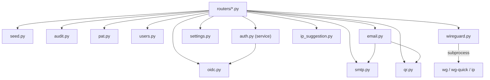

# Business services (`backend/app/services/`)

Services contain reusable logic, independent of the HTTP layer. Routers orchestrate them but never implement business logic themselves.

## `wireguard.py`

All interactions with the WireGuard system tools (`wg`, `wg-quick`) and network tools (`ip`).

| Function                                                   | Role                                                                                                                                                                                                      |
| ---------------------------------------------------------- | --------------------------------------------------------------------------------------------------------------------------------------------------------------------------------------------------------- |
| `_run(*args, stdin=None)`                                  | Runs a command **without a shell** (`create_subprocess_exec`), so that no value derived from user input (key, name, IP) can be interpreted by a shell. Raises `WireGuardError` on a non-zero return code. |
| `generate_keypair()`                                       | `wg genkey` + `wg pubkey` → private/public key pair.                                                                                                                                                      |
| `get_service_state()`                                      | `running`/`stopped`, inferred from `wg showconf`.                                                                                                                                                         |
| `start_service()` / `stop_service()` / `restart_service()` | Control the interface via `wg-quick up/down`.                                                                                                                                                             |
| `add_peer()` / `remove_peer()`                             | Adds/removes a peer **without restarting** the interface (`wg set ... peer ...`), with adjustment of the associated route.                                                                                |
| `reload_peers()`                                           | Hot-reloads the peer list (`wg-quick strip` + `wg syncconf`), without dropping existing connections — used after every client create/update/delete.                                                       |
| `get_status()`                                             | Parses the `wg show` output into a structure usable by the API (state, peers, transfer, last handshake).                                                                                                  |
| `build_client_config()`                                    | Generates the text content of a client's `.conf` file (`[Interface]`/`[Peer]`), from the client, server, and global settings.                                                                             |
| `build_server_config()`                                    | Generates the server-side `wg0.conf` content, including all **active** peers (`enabled=True`).                                                                                                            |
| `write_server_config()`                                    | Writes `build_server_config()` to disk (`/etc/wireguard/wg0.conf`), in an executor so as not to block the asyncio loop.                                                                                   |
| `get_machine_ips()`                                        | Lists the non-loopback IPs of the host machine (`ip -j address show`, falling back to `socket.getaddrinfo`).                                                                                              |

## `seed.py`

`seed_initial_data()` — called on **every** application startup (see [lifespan](../architecture/backend.md#4-lifecycle-lifespan)), idempotent:

1. `_seed_roles()`: creates the `admin` (`admin-read,admin-write,user-read,user-write`) and `user` (`user-read,user-write`) roles if they don't exist.
2. `_seed_admin()`: **only if no user exists yet**, creates the admin account (`ADMIN_USERNAME`/`ADMIN_EMAIL`) with a random password (`secrets.token_urlsafe(16)`), shown **once** in the logs (`WARNING` level).
3. `_seed_settings()` / `_seed_oidc_settings()` / `_seed_smtp_settings()`: create the default settings rows if absent.

## `audit.py`

- **`log_event(db, action, *, actor=None, target=None, details=None, request=None, success=True)`**: inserts an event (`AuditLog`) and **commits immediately**, independently of the caller's transaction — so the event is recorded even if the action itself subsequently fails. `actor` can be a `User` object (its `username` is extracted) or a raw string (useful for logging a failed login attempt with an invalid username).
- **`_prune(db)`**: called after every insertion. Deletes events older than `AUDIT_RETENTION_DAYS`, then, if the total count still exceeds `AUDIT_MAX_EVENTS`, deletes the oldest excess events.

Actions logged in the code: `auth.login`, `auth.login_failed`, `auth.logout`, `auth.password_changed`, `client.created/updated/deleted`, `server.updated/reset/apply/service.<action>`, `global_settings.updated/reset`, `smtp_settings.updated`, `oidc_settings.updated/reset`, `user.created/updated/deleted`, `pat.created/revoked`.

## `pat.py`

Generation and validation of Personal Access Tokens.

- **`generate_raw_token()`**: `wgui_pat_` + 32 random bytes as `token_urlsafe`. Returns `(raw_token, prefix)` — the prefix (about the first 17 characters) serves as a human-readable identifier without exposing the secret.
- **`hash_token(raw_token)`**: SHA-256 of the token — **only the hash is stored in the database** (no salt: tokens already have high entropy).
- **`expires_at_for(duration)`**: converts a code (`7d`, `30d`, `90d`, `1y`, `unlimited`) into an expiration date.
- **`resolve_user_from_pat(db, raw_token)`**: finds the active user owning a valid token (not expired, not revoked), updates `last_used_at`. Used by `auth.py` (`get_current_user`) when a token starts with the `wgui_pat_` prefix.

## `users.py`

- **`load_roles(db, role_ids)`**: resolves a list of role IDs into `Role` objects; raises `400` if the list is empty.
- **`count_active_admins(db)`**: counts active users with the `admin` role.
- **`ensure_not_last_active_admin(db, user)`**: raises `400` if `user` is the **last** active administrator — called before any deletion/deactivation/demotion.

## `auth.py` (service, not to be confused with `app/auth.py`)

- **`local_login_allowed(db)`**: returns `False` if OIDC-only mode is enabled (`OidcSettings.enabled and oidc_only`), thereby blocking local password login.
- **`authenticate_user(db, username, password)`**: verifies credentials; explicitly rejects `auth_source == "oidc"` accounts (they have no usable local password) with the same generic message as invalid credentials, so as not to disclose an account's authentication method.

## `oidc.py`

All OIDC / OpenID Connect logic. Detailed in [Authentication & security](authentification.md#oidc-single-sign-on).

## `smtp.py` / `settings.py`

CRUD for the _singleton_ `SmtpSettings` and `GlobalSettings` settings:

- `get_or_create_smtp_settings(db)` / `get_or_create_settings(db)`: retrieves the existing row or creates it with default values.
- `build_smtp_response()`: builds the response schema, **always excluding the password**.
- `build_smtp_update_dict()`: builds the update dictionary, **keeping the existing password** if the payload doesn't provide a new one (avoids overwriting an already-saved secret with an empty value).
- `SMTP_DEFAULTS` / `SETTINGS_DEFAULTS`: values used by the `DELETE /reset` endpoints.

## `email.py`

- **`send_client_config_email()`**: sends the configuration email to a client — renders the Jinja2 template matching the language (`client_config_en/fr/es.html`, in `backend/app/templates/`), generates the inline QR code, attaches the `.conf` file.
- **`_resolve_mail_from()`**: determines the valid sender address (`from_address`, falling back to the SMTP `username`), raises a clear error if neither is a valid email address.
- Uses `fastapi-mail` for actual SMTP sending (configurable TLS/SSL).

## `ip_suggestion.py`

**`suggest_next_ip(server_cidr, allocated_ips)`**: computes the next free IP in the server's network — reserves the server's own address (first usable host of the CIDR), excludes IPs already allocated to clients, returns the first still-free address (or `None` if the network is full or the CIDR is invalid).

## `qr.py`

**`generate_qr_code_base64(content)`**: generates a PNG QR code from the text content of a `.conf` file, base64-encoded — used both by the API (`GET /api/clients/{id}/config`) and by the configuration email.

## Dependency overview

